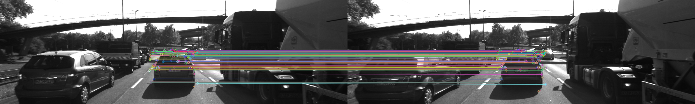
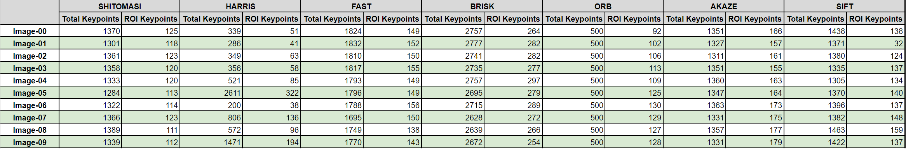
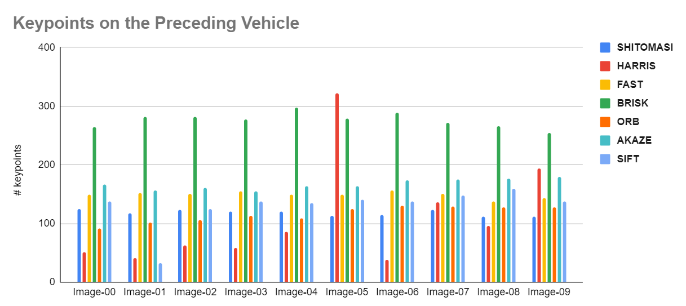
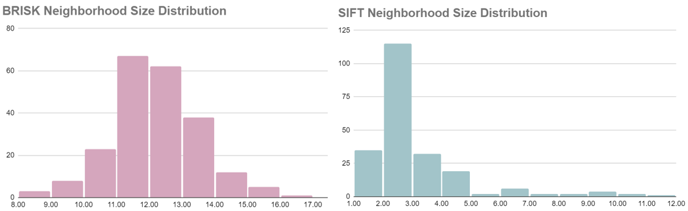
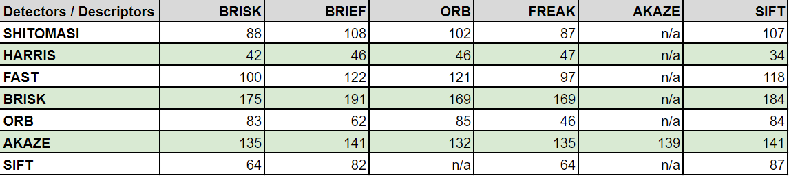
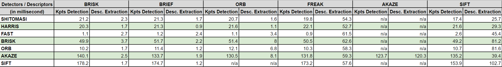

# 2D Feature Tracking Project


### I. Preparation on Ubuntu

If you plan to run the project locally, please see instructions in the section *II. Dependencies for Running Locally* in the [Camera/README.md](../README.md). But the license issue may occur when using some non-free algorithm. In this case, we need to use Udacity online workspace instead.

Clone the project, compile and run the program with arguments.
```bash
$ cd Camera/Lesson-5-Project-2D-Feature-Tracking
$ mkdir build && cd build
$ cmake ..
$ make

# Usage: ./2D_feature_tracking [detectorType] [descriptorType] [matcherType] [descriptorCategory] [selectorType]`
$ ./2D_feature_tracking AKAZE AKAZE MAT_BF DES_BINARY SEL_KNN
```


### II. Project Objectives

Build the feature tracking part and test various detector / descriptor combinations to see which ones perform best. Once you are finished with this project, the keypoint matching part will be set up and you can proceed to the next lesson, where the focus is on integrating Lidar points and on object detection using deep-learning. 


### III. Project Tasks

#### Task 1: Set up a ring buffer

The starter code of [MidTermProject_Camera_Student.cpp](./src/MidTermProject_Camera_Student.cpp) pushes all `DataFrame` structure to the data buffer vector for each loaded image. This project will only process several images and push-all works fine. But in a real-world scenario, thousands of images will be generated and that implementation would consume too much memory and slow down the system.

To prevent such issue, a ring buffer with a fixed size would be a better idea for memory optimization. Delete the oldest images from the `begin()` of the vector, and the latest images is always at the end of vector. ([354d54b](https://github.com/fanweng/Udacity-Sensor-Fusion-Nanodegree/commit/354d54b4fde2b971f25d6e2a3caf247ca0fb28e8))

#### Task 2 & 3: Implement keypoints detection

Implement Harris corner detection function `detKeypointsHarris()` with an argument to choose if using non-maximum suppression (NMS). ([60f5913](https://github.com/fanweng/Udacity-Sensor-Fusion-Nanodegree/commit/60f5913736ae0207d8793461c3608b252f21a181))

Implement various of modern detection methods (FAST, BRISK, ORB, AKAZE, SIFT) as well. ([64ff4da](https://github.com/fanweng/Udacity-Sensor-Fusion-Nanodegree/commit/64ff4da5561d093fb2e99d6893016ceb7c686572))

For a collision detection system, the preceding vehicle is the region-of-interest (ROI). Thus, it's better to remove keypoints outside the pre-defined ROI window. ([de15dd0](https://github.com/fanweng/Udacity-Sensor-Fusion-Nanodegree/commit/de15dd073f1c66215f5930343cb69885eb2781e3))

#### Task 4 & 5 & 6: Extract descriptors

Implement a variety of keypoint descriptor methods (BRIEF, ORB, FREAK, AKAZE, SIFT). ([6c0a14a](https://github.com/fanweng/Udacity-Sensor-Fusion-Nanodegree/commit/6c0a14af2b16c7ef57e4ca89e5e880f21b5404da))

For matching descriptors, add FLANN as alternative to the brutal-force method, and add K-Nearest-Neighbor (KNN) as an addition to the Nearest-Neighbor (NN). ([a2bcfea](https://github.com/fanweng/Udacity-Sensor-Fusion-Nanodegree/commit/a2bcfeab909ef77c150473ce1dd5b22b0a150f0e))

Implement the descriptor distance ratio test to filter the bad keypoint matches. ([62381f0](https://github.com/fanweng/Udacity-Sensor-Fusion-Nanodegree/commit/62381f024f780e8ababa5a10350e39f8d03ca792))

**Final Output of a FAST-ORB Keypoint Matching Image**



#### Task 7 & 8 & 9: Evaluate performance

**Metric 1 - Average number of keypoints detected**





**Distributions of Neighbourhood Size**



The ***Metric 1*** table and plot illustrate the average number of keypoints detected on the images as well as keypoints on the preceding vehicle (ROI). The BRISK, AKAZE and FAST are the three best keypoint detectors if considering the number of detected keypoints.

Some of the detectors have a fixed neighborhood size, e.g. SHITOMASI (4), ORB (31), HARRIS (6), FAST (7), AKAZE (4), while the distributions of neighborhood size of BRISK and SIFT are shown in the plot above.

**Metric 2 - Average number of keypionts matched**



In the table of ***Metric 2***, it shows the average matched keypoints for all possible detector-descriptor pairs.

**Metric 3 - Execution times**



The ***Metric 3*** results indicate the FAST detector leads a huge win over all other detectors in terms of detection execution time. FREAK, AKAZE, and SIFT descriptors tend to produce slow detection results.

**Recommendation**

Based on the metrics provided above, FAST detector demonstrates an unparalleled advantage in the keypoint detection speed as well as a good number of detected keypoints with some descriptor. I would recommend FAST-BRIEF, FAST-ORB, and FAST-BRISK as my Top-3 recommendation.

