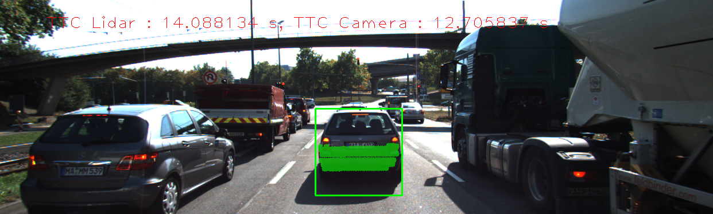
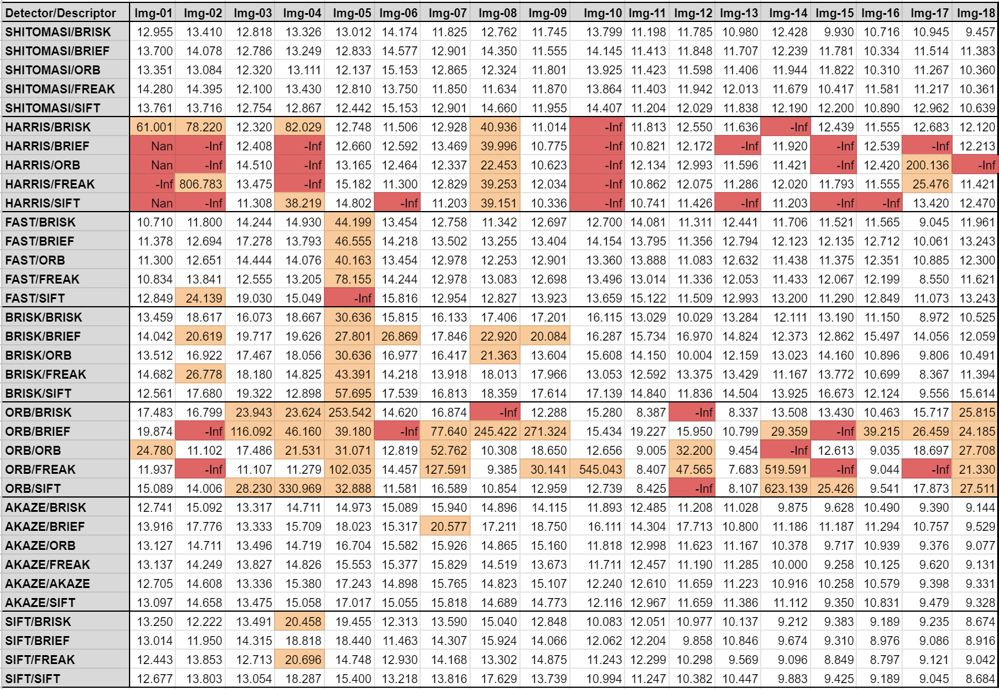
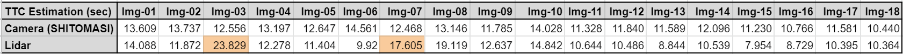

# 3D Object Tracking Project

By completing all the lessons, keypoint detectors, descriptors, and methods have been implemented to match them between successive images. Also, we know how to detect objects in an image using the YOLO deep-learning framework. And finally, it has been shown how to associate regions in a camera image with Lidar points in 3D space. This project will integrate all those techniques to tracking objects in a 3D space.


## I. Build Instructions

1. Clone this repo.
`$ git clone https://github.com/fanweng/Udacity-Sensor-Fusion-Nanodegree.git`
2. Make a `build` directory in the `Camera/Lesson-7-Project-3D-Object-Tracking` directory.
`$ mkdir build && cd build`
3. Compile.
`$ cmake .. && make`
4. Run the program.
`$ ./3D_object_tracking`

> **Note 1:** make sure the OpenCV with non-free feature is successfully built at local Ubuntu environment, otherwise just Workspace provided by Udacity.
> **Note 2:** this repo doesn't contain valid YOLO parameters (large file restriction), i.e. yolov3-tiny.weights and yolov3.weights in the project. Please download those two files from the Udacity Workspace. 


## II. Project Tasks


The design of the project is based on the schematic shown above. I completed the following tasks to achieve that goal.

#### 0. Match 2D objects

In the [matching2D_Student.cpp](./src/matching2D_Student.cpp), I resued the mid-term project code to detect keypoints, extract descriptors and match descriptors. Various type of detectors and descriptors are implemented. ([3f78bae](https://github.com/fanweng/Udacity-Sensor-Fusion-Nanodegree/commit/3f78baee292a87ea4974cf637077b527ecf5433c))

#### 1. Match 3D Objects

In the [camFusion_Student.cpp](./src/camFusion_Student.cpp), I implemented `matchBoundingBoxes()` method, in which inputs are previous and the current data frames as well as matched keypoints between the two frames. Only those bounding boxes containing the matched keypoints will be considered, i.e. within the ROI. For each bounding box in the previous frame, only one best match in the current frame is extracted. The final output is a hashmap of bounding box matches. ([63d2b20](https://github.com/fanweng/Udacity-Sensor-Fusion-Nanodegree/commit/63d2b206722ef6ffc1fd612227affa1bd3999cd0))

#### 2. Compute TTC with Lidar data

In the [camFusion_Student.cpp](./src/camFusion_Student.cpp), `computeTTCLidar()` method was implemented. To eliminate the outliers (e.g. too close to ego vehicle), I used 20% of the total number of Lidar points to calculate the averaging closest distance to the preceding vehicle. This would be more robust than simply using the closest Lidar point. ([cc31837](https://github.com/fanweng/Udacity-Sensor-Fusion-Nanodegree/commit/cc318378f5741854b1086e21d47ed6c9364b8e9b))

#### 3. Associate keypiont correspondences with bounding boxes

In the [camFusion_Student.cpp](./src/camFusion_Student.cpp), `clusterKptMatchesWithROI()` method was developed to associate keypoint correspondences with bounding boxes. All keypoint matches must belong to a 3D object, simply checking whether the corresponding keypoints are within the ROI in the camera image. To have a robust TTC estimation, outliers among the matches are removed using the mean of all euclidean distances between keypoint matches. ([35a4741](https://github.com/fanweng/Udacity-Sensor-Fusion-Nanodegree/commit/35a4741cc62d47bf9d6497fc2a50f538ba27265b))

#### 4. Compute TTC with camera images

In the [camFusion_Student.cpp](./src/camFusion_Student.cpp), using the knowledge learned in the [Lecture 2-2 Collision Detection Systems](../../lectures/lec2-2-collision-detection-system.md), I completed the `computeTTCCamera` method. ([5271344](https://github.com/fanweng/Udacity-Sensor-Fusion-Nanodegree/commit/5271344f13cadc9d882d56c7e23fd2d7bbc36531))

After finishing the pipeline in the [FinalProject_Camera.cpp](./src/FinalProject_Camera.cpp), I could generate TTC estimations based on both Lidar points and Camera images. An example output looks like the screenshot below.




## III. Performance and Results

And lastly, I conducted various tests with different detector/descriptor combinations using the same framework. The table below shows camera-based TTC estimations of all combinations I tested. Some unstable results (indicated in orange) are spotted and those faulty estimations appear quite often for particular detector types, like FAST, BRISK, and ORB. Some detector types are also more prone to produce clearly wrong results (indicated in red), like HARRIS and ORB. Those faults could be a result of keypoint detection and matching process.



Take the estimation results on *Img-14* as an example, particularly on two detector/descriptor combinations - *SHITOMASI/SIFT* and *ORB/SIFT* (see screenshots and execution logs below). The estimation based on *ORB/SIFT* combination is clearly a wrong value (623.139s), and it could be cause by the limited number of keypoints/matches detected. As a comparison, *SHITOMASI/SIFT* combination produces a reasonable TTC estimation (12.190s) where it detects 30% more keypionts/matches.


```bash
# ORB/SIFT outputs on Img-14
ORB detector with n=500 keypoints in 13.6058 ms
ORB detector with n=96 keypoints in the rectangle ROI
MAT_BF matching produced n=95 matches in 0.463706 ms
TTC Estimation: 623.139s

# SHITOMASI/SIFT outputs on Img-14
Shi-Tomasi detection with n=1886 keypoints in 13.5002 ms
SHITOMASI detector with n=127 keypoints in the rectangle ROI
MAT_BF matching produced n=138 matches in 1.32935 ms
TTC Estimation: 12.190s
```

Based on the above analysis, I would be more confident with the results generated by SHITOMASI detector. I averaged out the 5 SHITOMASI detector test results for 18 frames to produce the camera-based TTC estimation in the table below. Also, I compared the Lidar-based estimation with the SHITOMASI outputs frame by frame. Two Lidar results are questionable (indicated in orange) because their values are almost doubled compared to the previous frames. A more robust way of filtering out outlier Lidar points would be helpful to mitigate the faulty Lidar-based estimation.



I collected 18 frames of TTC estimation and made the following short clip for demonstration. SHITOMASI-BRISK combination was used for camera-based estimation.

