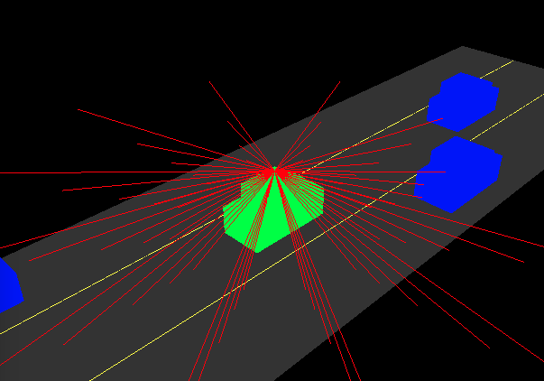
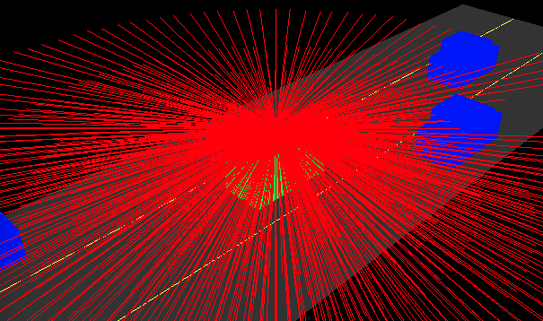
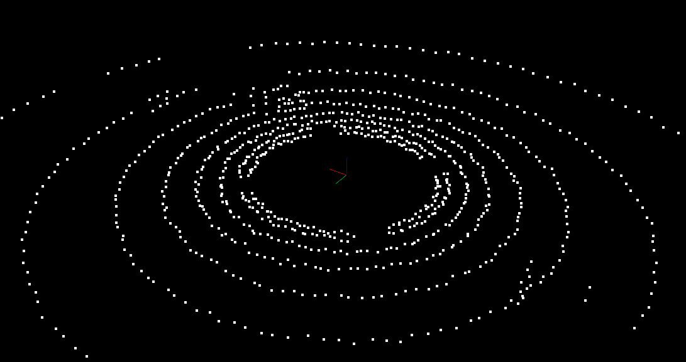
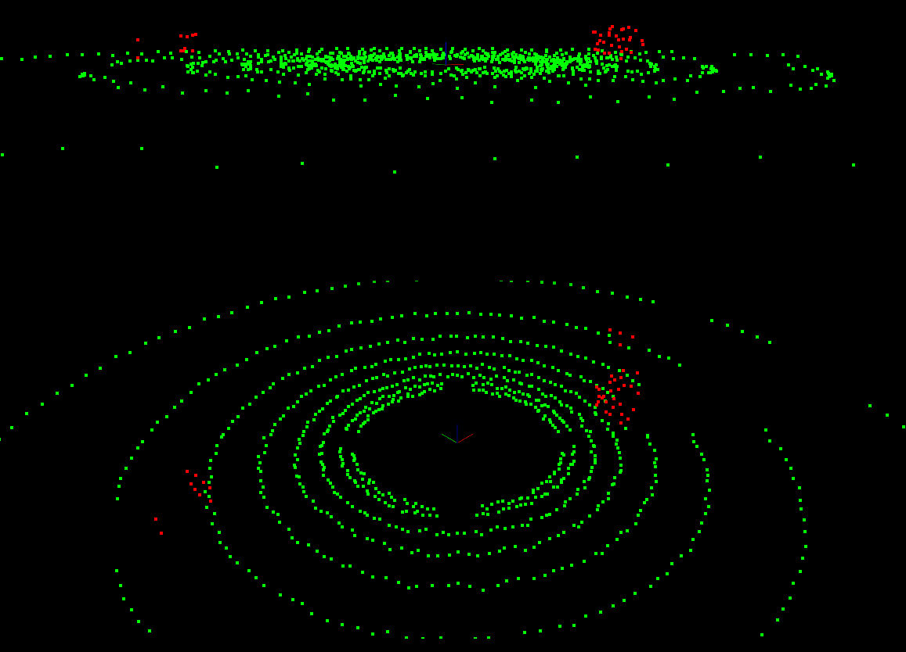
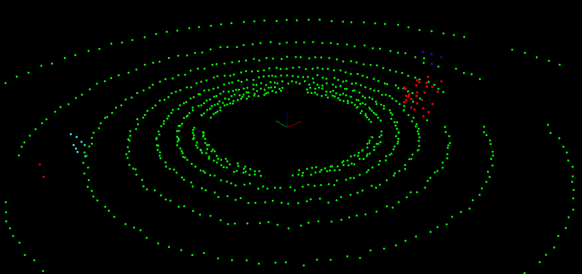
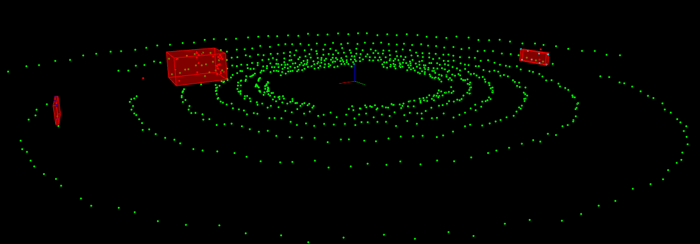
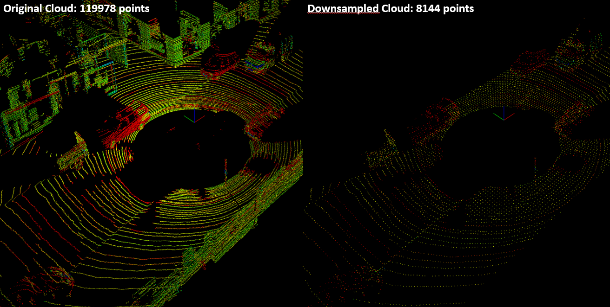
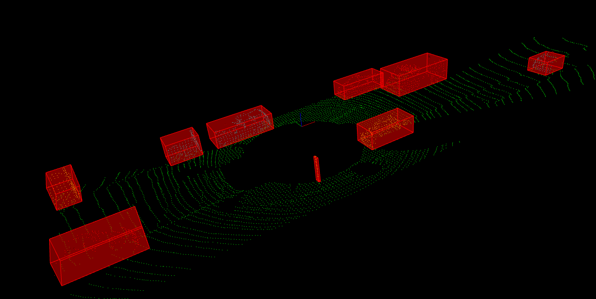
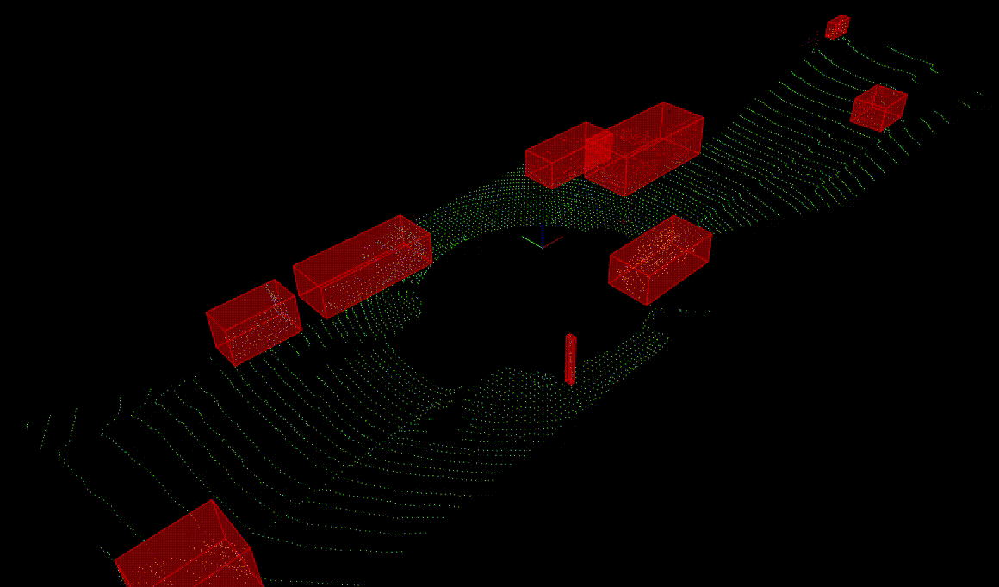
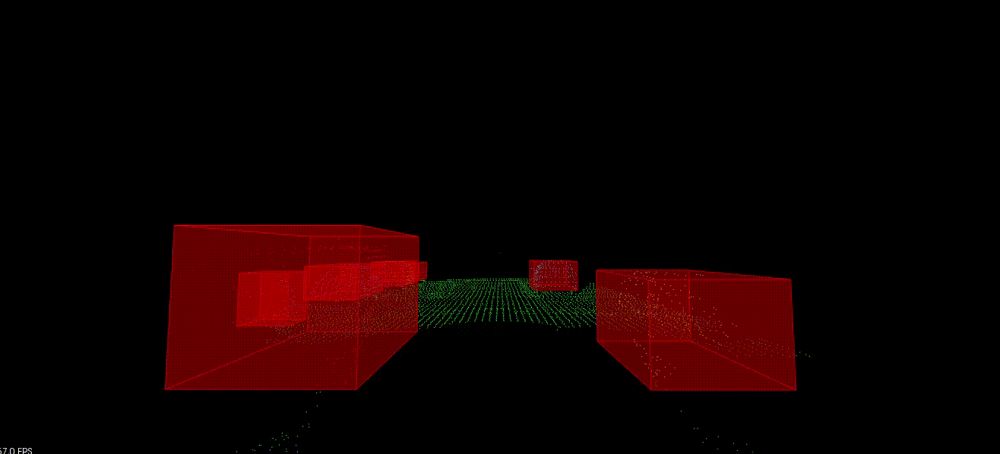

# Lidar Obstacle Detection Project


### I. Preparation on Ubuntu

For this project, the virtual Ubuntu environment was provided by the Udacity. Install the Point Cloud Library (PCL) and clone the project starter code [SFND_Lidar_Obstacle_Detection](https://github.com/udacity/SFND_Lidar_Obstacle_Detection.git) to the Ubuntu environment.

```bash
$ sudo apt install libpcl-dev
$ git clone https://github.com/udacity/SFND_Lidar_Obstacle_Detection.git ./Lidar_Obstacle_Detection
```

The directory structure of the starter code looks like:
- src
    * render
        + `box.h`: struct definition for box objects
        + `render.h`, `render.cpp`: classes and methods for rendering objects
    * sensors
        + `lidar.h`: functions using ray casting for creating PCD
    * `environment.cpp`: main file for using PCL viewer and processing/visualizing PCD
    * `processPointClouds.h`, `processPointClouds.cpp`: functions for filtering, segmenting, clustering, boxing, loading and saving PCD

Try compiling the lidar simulator and run it. A window with a simulated highway environment should pop up.
```bash
$ cd Lidar_Obstacle_Detection
$ mkdir build && cd build
$ cmake ..
$ make
$ ./environment
```


### II. Exercises

#### Lidar and Point Clouds

1. Create a `Lidar` pointer object on the heap, taking two parameters: `std::vector<Car>` and `setGroundSlope` of 0. The `Lidar::scan()` method does a ray casting and returns a point cloud pointer object `pcl::PointCloud<pcl::PointXYZ>::Ptr`. Call `renderRays()` to plot rays on the viewer. ([7140d05](https://github.com/fanweng/Udacity-Sensor-Fusion-Nanodegree/commit/7140d05554c3d98b23f2886fb3bacb120fbd7bdc))



2. Increase the lidar resolution by tweaking the constructor of `Lidar` class: `numLayers`, `horizontalAngleInc`. Set `minDistance` to 5 meter to remove points from the vehicle's rooftop. Set `sderr` to 0.2 to add some noises to the PCD. ([16d5d3c](https://github.com/fanweng/Udacity-Sensor-Fusion-Nanodegree/commit/16d5d3c71ce1ea0acb13e5f44a03f82c63441107))



3. Remove rendering for the highway scene and rays, but enable rendering for the point cloud using `renderPointCloud()`. ([80be982](https://github.com/fanweng/Udacity-Sensor-Fusion-Nanodegree/commit/80be98228972e525dea72ef4f360045988db2361))



#### Point Cloud Segmentation

1. In the `processPointCloud.cpp`, to implement the `ProcessPointClouds::SegmentPlane()` method, use a `pcl::SACSegmentation<PointT>` object to segment the planar component from the input point cloud. Next to implement the `SeparateClouds()` helper method, use a `pcl::ExtractIndices<PointT>` object to extract the points not belong to the plane as the obstacles. ([24ae844](https://github.com/fanweng/Udacity-Sensor-Fusion-Nanodegree/commit/24ae844bc49f310c10837b4cd13df51409472827))

2. In the `environment.cpp`, create a `ProcessPointClouds<pcl::PointXYZ>` object, call `SegmentPlane()` to separate the plane and obstacle. Finally, render the plane and obstacle point clouds. ([24ae844](https://github.com/fanweng/Udacity-Sensor-Fusion-Nanodegree/commit/24ae844bc49f310c10837b4cd13df51409472827))



#### Identify Different Obstacles using Euclidean Clustering with PCL

1. In the `processPointCloud.cpp`, to implement the `ProcessPointClouds::Clustering()` method, create a Kd-tree representation `pcl::search::KdTree<PointT>::Ptr` for the input point cloud, configure the parameters for the Euclidean clustering object `pcl::EuclideanClusterExtraction<PointT>` and extract the clusters in the point cloud. In the `environment.cpp`, call the clustering function on the segmented obstacle point cloud, render clustered obstacle in different colors. ([a5761ac](https://github.com/fanweng/Udacity-Sensor-Fusion-Nanodegree/commit/a5761ac9fed23bdebb5cb9ca96c56b2dca26a063))



#### Bounding Boxes

1. Once point cloud clusters are found, we can add bounding boxes around the clusters. The boxed spaces should be considered as an area/object that our car is not allowed to enter, otherwise it would result a collision. Call `ProcessPointClouds::BoundingBox()` method, which finds the max and min point values as the boundary values for the `Box` data structure. Then render the `Box` structure for each cluster. ([e85af3f](https://github.com/fanweng/Udacity-Sensor-Fusion-Nanodegree/commit/e85af3fc5c27da0605243a6fbcd1ee63135002f8))



#### Load Real PCD

1. Create a new point processor for the real PCD from a `cityBlock`, the code is similar to the `simpleHighway` function. The point type is `pcl::PointXYZI` where the `I` indicates the intensity. The real PCD files are located at `src/sensors/data/pcd/data_1/` directory. ([5a0f545](https://github.com/fanweng/Udacity-Sensor-Fusion-Nanodegree/commit/5a0f545ab7fe9d89635a4f66ada69257f6d28e82))


#### Filter with PCL

1. To implement the `ProcessPointClouds::FilterCloud()` in the `processPointClouds.cpp`, `pcl::VoxelGrid<PointT>` class is applied for **Voxel Grid** filtering, and `pcl::CropBox<PointT>` class is applied for **ROI-based** filtering. The `Eigen::Vector4f` class has four parameters representing `x`, `y`, `z` coordinates and the last one should be 1.0. We are interested in a good amount of distance in front or at back of the car and surroundings of the car. Point cloud data outside of the ROI should be removed, including the rooftop points. ([61ccf99](https://github.com/fanweng/Udacity-Sensor-Fusion-Nanodegree/commit/61cc9ffe707fcec0ee3390b56aac42a8c1750167))

2. In the `environment.cpp`, call `ProcessPointClouds::FilterCloud()` function in the `cityBlock()`. Input a leaf size of 0.2m, so that the voxel size is large enough to help speed up the processing but not so large that object definition is preserved.



#### Obstacle Detection with Real PCD

1. Once having a filtered PCD, we can deploy the same segmentation and clustering techniques implemented previously in the `cityBlock()`. ([85cc8c6](https://github.com/fanweng/Udacity-Sensor-Fusion-Nanodegree/commit/85cc8c67cd2f583271c9ee34505688f0ca5cb1ac))

2. Tweak the `Eigen::Vector4f minPoint/maxPoint` for `ProcessPointClouds::FilterCloud()` and `int minSize/maxSize` for `ProcessPointClouds::Clustering()`. ([85c7c1a](https://github.com/fanweng/Udacity-Sensor-Fusion-Nanodegree/commit/85c7c1adbbf2f8384f71459dedb09f24b828bac1))



#### Stream PCD

1. Create a vector `stream` to store paths to the PCD files chronologically. Create a new `cityBlock()` function, which processes the input point cloud from the external. In the `main()` function of `environment.cpp`, inside the viewer update loop, read PCD file, process it and update the viewer. ([221ce08](https://github.com/fanweng/Udacity-Sensor-Fusion-Nanodegree/commit/221ce08a98a9bc8baafab0f302819afac91ac2bf))




### III. Lidar Obstacle Detection Project

The previous exercises have created a processing pipeline for detecting the obstacles using PCL segmentation and clustering methods. In the final project, we have to implement the same obstacle detection pipeline but with the *3D RANSAC segmentation*, *KD-Tree*, and *Euclidean clustering algorithm* we created in the quizzes.

1. Create a `ProcessPointClouds::SegmentPlaneRansac()` function in the `processPointClouds.cpp`, which uses the 3D RANSAC segmentation for plane implemented in the quiz. And call this segmentation function in the `cityBlock()` of `environment.cpp`. ([ba99dbd](https://github.com/fanweng/Udacity-Sensor-Fusion-Nanodegree/commit/ba99dbd3822d668971056c2cd8abdf7f50d5400f))

2. Create `ProcessPointClouds::ClusteringEuclidean` and its helper function `ProcessPointClouds::clusterHelper` in the `processPointClouds.cpp`, which reuses the Euclidean clustering with KD-Tree with some modification from the quiz. And call this clustering function in the `cityBlock()` of `environment.cpp`. ([0a5efcd](https://github.com/fanweng/Udacity-Sensor-Fusion-Nanodegree/commit/0a5efcd518f5dc8948df6e56c870e342952df76a))

3. Before building the final project, make sure the macro `CUSTOM_METHOD` is defined in the `environment.cpp` so that the custom implementations in the Step 1 and 2 are used. Otherwise, defining macro `PCL_METHOD` will use the segmentation and clustering functions provided by PCL library.




### IV. Tracking and Challenge Problem


### V. References

`pcl::PointXYZ`: https://pointclouds.org/documentation/structpcl_1_1_point_x_y_z.html

Example of segmenting the Plane with PCL: https://pointclouds.org/documentation/tutorials/extract_indices.html

Example of Euclidean Cluster Extraction: https://pointclouds.org/documentation/tutorials/cluster_extraction.html

Example of Voxel Grid filtering: https://pointclouds.org/documentation/tutorials/voxel_grid.html

Example of Crop Box filtering: https://pointclouds.org/documentation/classpcl_1_1_crop_box.html