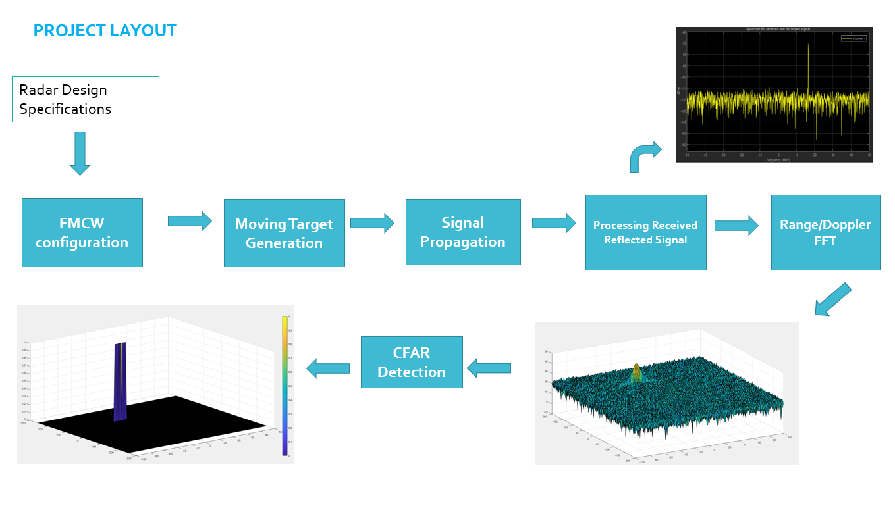
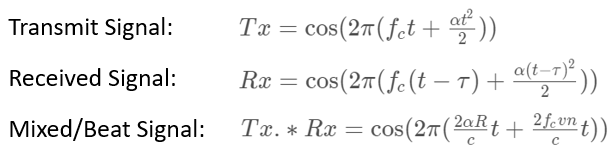
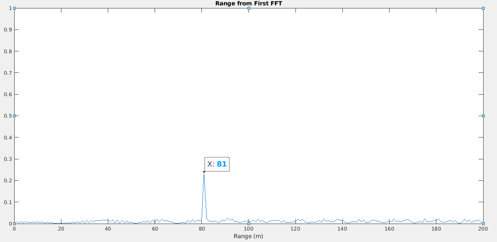
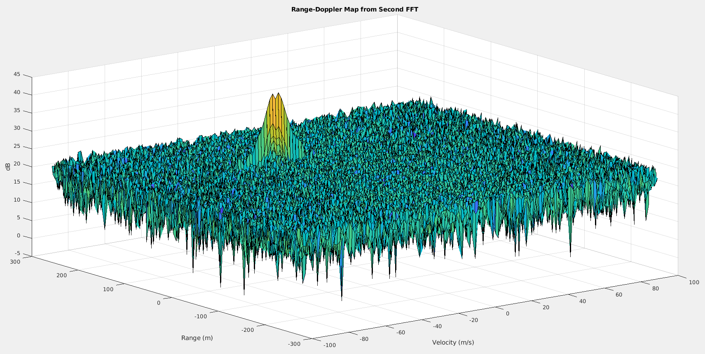
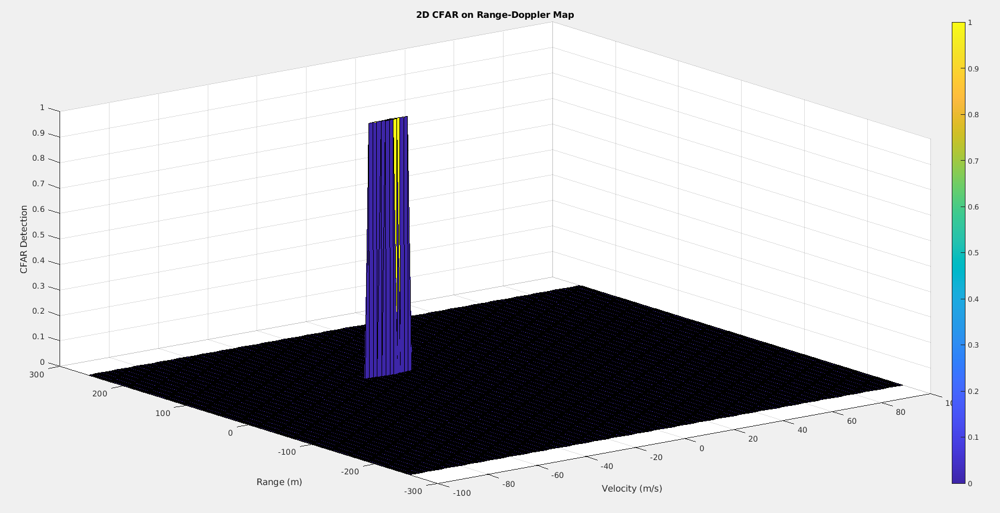

# Radar Target Generation and Detection Project

## Project Layout

- Configure the FMCW waveform based on the system requirements
- Define the range and velocity of target and simulated its displacement
- For the same simulation loop, process the  transmit and receive signal to determine the beat signal
- Perform Range FFT on the received signal to determine the Range
- Perform the CFAR processing on the output of 2nd FFT to display the target



### 1. System requirements

I define the initial position of the target vehicle is *80m* ahead and its constant velocity is *-25m/s*.

```matlab
range = 80;         % target initial position (m)
velocity = -25;     % target initial velocity (m/s)
```

System requirements define the design of a radar.

| | |
|-|-|
| Frequency         | 77 GHz    |
| Range Resolution  | 1m        |
| Max Range         | 200 m     |
| Max Velocity      | 70 m/s    |
| Velocity Resolution | 3 m/s   |

The above requirements can yield radar specifications: `Bsweep`, `Tchirp`, and `Slope`. Code commit ([7340d6d](https://github.com/fanweng/Udacity-Sensor-Fusion-Nanodegree/commit/7340d6d499fbb872c4035d3f0da15e62d8412645#diff-5ecfb573c1b1647b580b68277423bd87efeb2596ebb64aba81d14219fdbe1dd1))

```matlab
c = 3e8;                    % speed of light (m/s)
B = c / (2 * range_res);    % Sweep bandwidth
Tchirp = 5.5 * 2 * range_max / c;   % Sweep time
slope = B / Tchirp;         % Slope of chirp signal
```

### 2. Signal propagation

FMCW transmit and received signals are defined using the wave equations, where the alpha `a` is the `Slope`. The received signal is nothing but the time delayed version of the transmit signal.

On mixing these two signals, we get the beat signal by *element-by-element multiplication* of two signal matrices: `times(Tx, Rx)` or `Tx.*Rx`.



The loop iterates all timestamps in the `t`, calculates the `range(t)` using constant velocity model and `Tx(t)`/`Rx(t)` using wave propagation equations. At the end, generate the beat signal by mixing the Tx and Rx.

```matlab
for i=1:length(t)
    % For each time stamp update the Range of the Target for constant velocity.
    range_t(i) = range + velocity * t(i);
    td(i) = (2 * range_t(i)) / c;

    % For each time sample we need update the transmitted and received signal.
    Tx(i) = cos(2 * pi * (fc * t(i) + (slope * t(i)^2) / 2));
    Rx(i) = cos(2 * pi * (fc * (t(i) - td(i)) + (slope * (t(i) - td(i))^2) / 2));

    % Now by mixing the Transmit and Receive generate the beat signal
    % This is done by element wise matrix multiplication of Transmit and Receiver Signal
    Mix(i) = Tx(i) .* Rx(i);
end
```

### 3. FFT operation

First FFT was implemented on the mixed/beat signal, outputting a peak at the range of the vehicle. The FFT result is *81m* is within the *+/-10m* criteria.



By implementing the 2D FFT on the beat signal, we can extract both **Range** and **Doppler** information - a Range-Doppler Map (RDM).



### 4. 2D CFAR

I chose to use 7 training cells and 2 guard cells in both range and doppler dimensions. Offset to the threshold was set to 5dB.

```matlab
Tr = 7; % training cells for range
Td = 7; % training cells for doppler

Gr = 2; % guard cells for range
Gd = 2; % guard cells for doppler

offset = 5;
```

A for-loop iterates the RDM, doing the following operations:
- calculate the sum of noise level of training cells by subtracting the non-training cell noise from the all cells' noise level
- average the summed noise level of all training cells
- offset the threshold
- compare the signal under cell under test (CUT) against the threshold
- if CUT signal level is larger than the threshold, the CFAR value is set to 1, otherwise the value is 0

```matlab
Tcell_num = range_size * doppler_size - (2 * Gr + 1) * (2 * Gd + 1);
signal_cfar = zeros(Nr/2, Nd);
for i = 1+Tr+Gr:(Nr/2 - (Gr+Tr))
    for j = 1+Td+Gd:(Nd - (Gd+Td))
        sum_all_cells = sum(db2pow(RDM(i-(Tr+Gr):i+Tr+Gr, j-(Td+Gd):j+Td+Gd)), 'all');
        sum_excl_Tcell  = sum(db2pow(RDM(i-Gr:i+Gr, j-Gd:j+Gd)), 'all');
        noise_level = sum_all_cells - sum_excl_Tcell;

        threshold = noise_level / Tcell_num;
        threshold = db2pow(pow2db(threshold) + offset);

        signal = db2pow(RDM(i,j));
        if (signal <= threshold)
            signal_cfar(i,j) = 0;
        else
            signal_cfar(i,j) = 1;
        end
    end
end
```

The CFAR result shown below indicates the velocity of the target vehicle is about *-20m/s*, which is within the *+/-10m/s* criteria.

