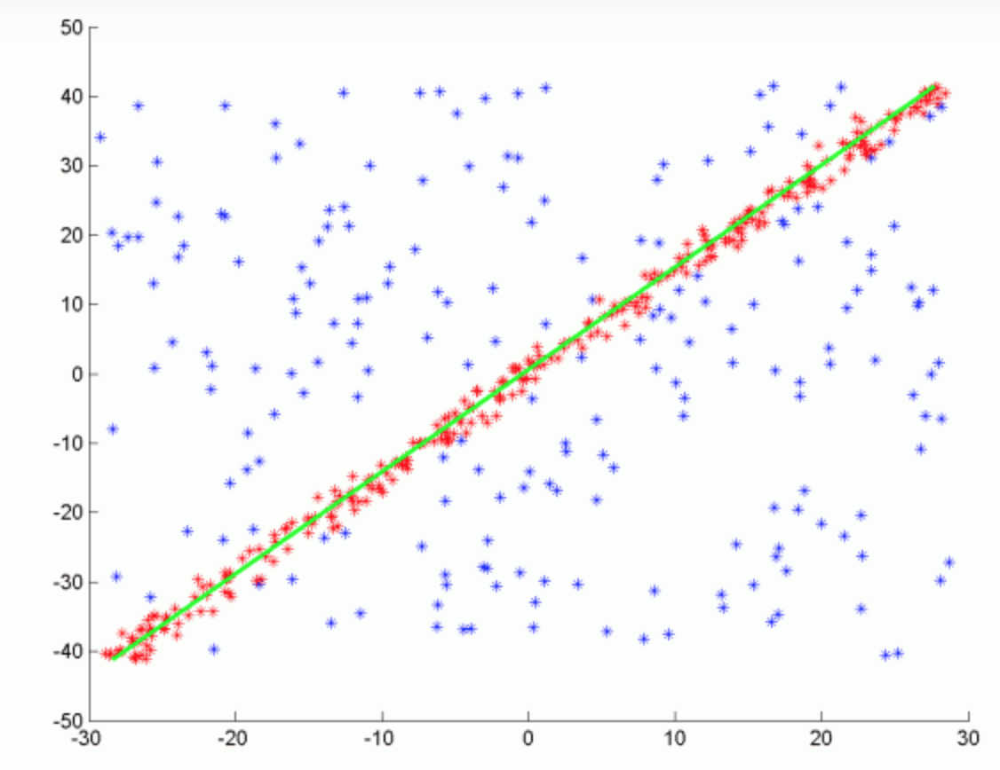
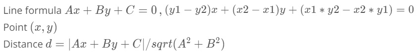
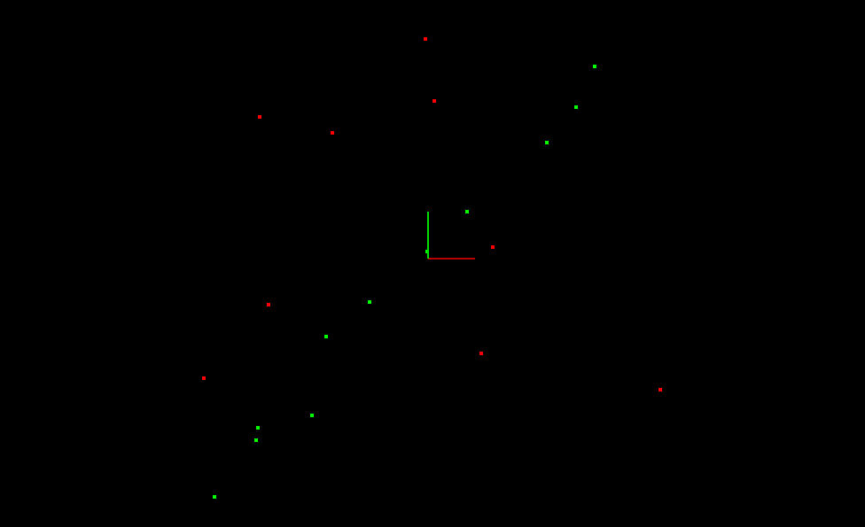
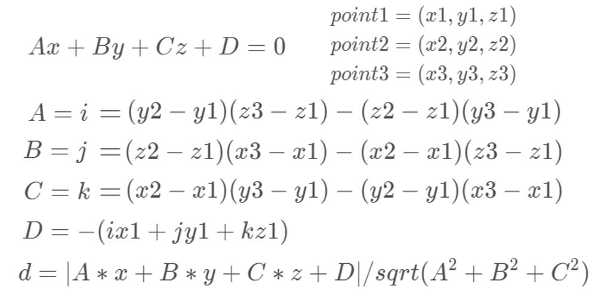

# Lesson 1-2 Point Cloud Segmentation

### I. Segmentation

Segment out a group of points belong to some certain object in the environmental scene from the point cloud.

### II. RANSAC

RANSAC stands for Random Sample Consensus, a method for detecting outliers in data.

- RANSAC runs iterations and returns the model with the best fit
    * each iteration randomly picks a subsample of the data and fits a model through it, such as line or a plane
    * the iteration with the highest number of inliers or lowest noise is used as the best model

- RANSAC version to implement in the quiz uses the **smallest possible subset of points** to fit
    * line (two points), plane (three points)
        + iterate through every remaining points and calculate its distance to the model
        + points that are within a certain distance to the model are counted as **inliers**
        + the iteration has the **highest number of inliers** is the best model

- Other RANSAC version samples **some percentage of the model points** to fit
    * for example, 20% of the total points, then fit a line to that
        + the error of that line is calculated
        + the iteration with the **lowest error** is the best model

### III. RANSAC 2D Quiz

`Lidar_Obstacle_Detection/src/quiz/ransac/ransac2d.cpp` implements RANSAC for fitting a line in 2D point cloud data with outliers. `RansacLine1()` is my solution and `RansacLine2()` is the solution provided by Udacity. The basic idea is:

1. Randomly pick out two points from the point cloud data, fit a line with the two points.
2. Iterate the rest of points in the point cloud data, calculate its distance to the fitted line. If distance is within the tolerance, we consider it as an inlier.
3. Repeat the same procedure, find a group of points with most number of inliers.

The `pcl::PointCloud<PointT>` class is defined here: [https://pointclouds.org/documentation/singletonpcl_1_1_point_cloud.html](https://pointclouds.org/documentation/singletonpcl_1_1_point_cloud.html)

Build and run the quiz, the output shows a line is separated outfrom the point cloud.

### IV. Extending RANSAC to 3D Plane

Extend the `Lidar_Obstacle_Detection/src/quiz/ransac/ransac2d.cpp` to implement RANSAC for fitting a plane in 3D point cloud data with outliers. `RansacPlane()` is my solution and the basic idea is:

1. Randomly pick out three points from the point cloud data, fit a plane with three points.
2. Iterate the rest of points in the point cloud data, calculate its distance to the fitted plane. If distance is within the tolerance, we consider it as an inlier.
3. Repeat the same procedure, find a group of points with most number of inliers.

References used: [Equation of a plane passing three points](https://www.geeksforgeeks.org/program-to-find-equation-of-a-plane-passing-through-3-points/), [Distance between a point and a 3D plane](https://www.geeksforgeeks.org/distance-between-a-point-and-a-plane-in-3-d/?ref=lbp).

In the main function, change to use `CreateData3D()` and call `RansacPlane()` function. Build and run the quiz, the result shows a plane is separated out from the point cloud.

### V. References

[RANSAC - Computer Vision](http://www.cs.cornell.edu/courses/cs4670/2015sp/lectures/lec13_ransac_web.pdf)

[Using RANSAC for estimating geometric transforms in computer vision](https://de.mathworks.com/discovery/ransac.html)

[The RANSAC Algorithm](http://homepages.inf.ed.ac.uk/rbf/CVonline/LOCAL_COPIES/FISHER/RANSAC/)