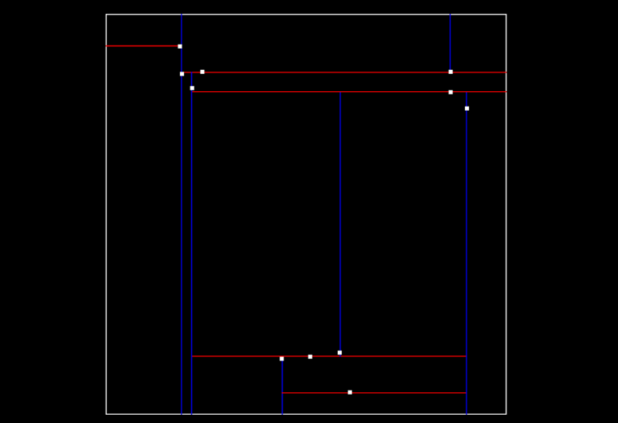
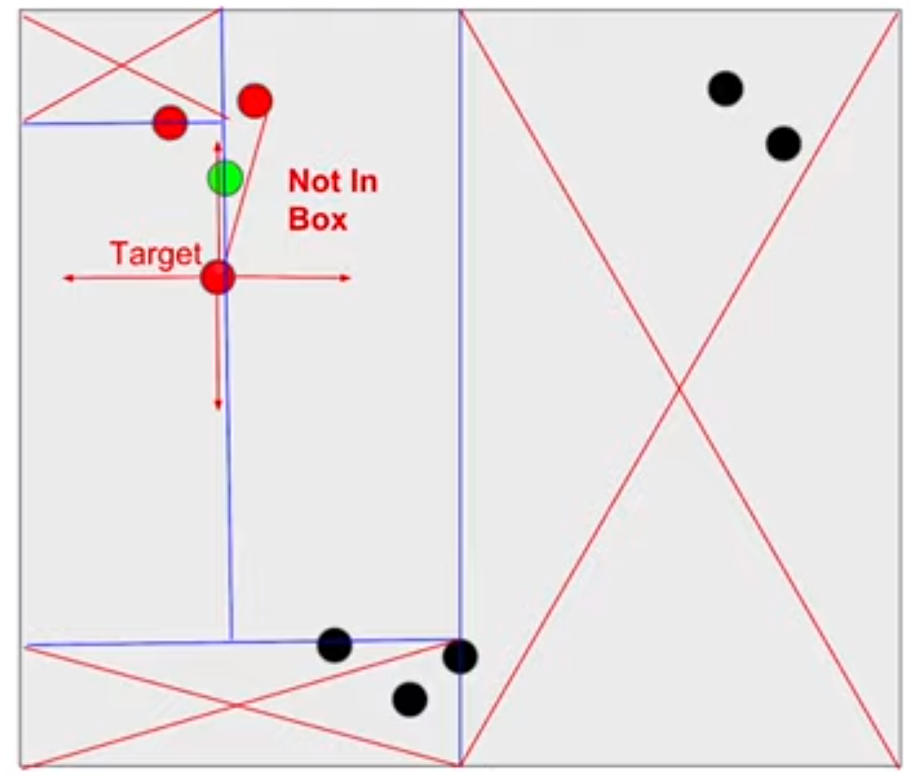
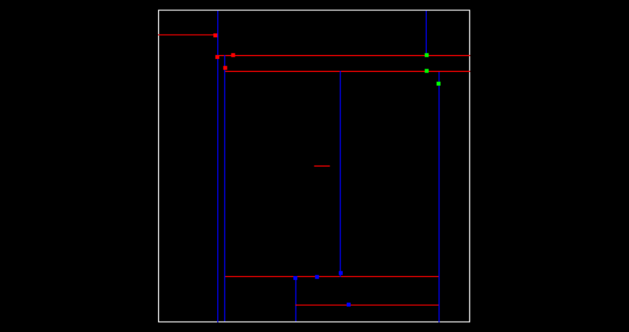

# Lesson 1-3 Clustering Obstacles

Segmenting points allows us to recognize the obstacles. It would be great to break up and group those obstacle points, especially for the multiple object tracking with cars, pedestrians, and bicyclists, etc. One way to do that grouping and cluster point cloud data is called euclidean clustering.

### I. Euclidean Clustering

This method associates groups of points by how close together they are. To do a nearest neighbor search efficiently, a **KD-Tree** data structure which could speed up the look up time from *O(n)* to *O(log(n))*. By grouping points into regions in a KD-Tree, you can avoid calculating distance for possibly thousands of points just because you know they are not even considered in a close enough region.

### II. Implement KD-Tree Quiz

A KD-Tree is a binary tree that splits points between alternating axes. By separating space by splitting regions, nearest neighbor search can be made much faster when using an algorithm like euclidean clustering.

The node of KD-Tree looks like:
```c++
struct Node
{
    std::vector<float> point;   // point coordinates
    int id;                     // unique index to tell which point is referenced from the point cloud
    Node* left;
    Node* right
    ... ...
}
```

#### Insert 2D points to KD-Tree

At each depth of the KD-Tree, one coordinate value will be compared, either `x` or `y`. It is also called splitting the `x` or `y` region, which is defined by `depth % 2`: an even `depth` value will split `x` region, an odd `depth` value will split `y` region. The inserting point goes to the **left child** if the coordinate value is **smaller** than current node, goes to the **right child** if it is **larger**. ([dd0bf1f](https://github.com/fanweng/Udacity-Sensor-Fusion-Nanodegree/commit/dd0bf1fb72fdd0b7486e4c3ed39adc72c0ec7834))



#### Search points in a KD-Tree

The next function to implement is searching for nearby points in a KD-Tree compared to a given target point. The easiest way to come up is simply calculating distances for every single points in the KD-Tree and comparing with the tolerance.

However, KD-Tree is able to split regions and allows certain regions to be completely ruled out, speeding up the process of finding nearby neighbors. First, compare distance within a boxed square that is 2x `distanceTol` for length, centered around the target point. If the current node `point` is within this box, then calculate the distance and see if the point `id` should be added to the list of nearby `ids`. Last, recursively branch off to the next node, left or right, depending on if the boxed square crosses over the divided `x` or `y` region. The advantage being that if the box region is not inside some division region you completely skip that branch. ([f19f751](https://github.com/fanweng/Udacity-Sensor-Fusion-Nanodegree/commit/f19f751d5316c90f054f8d2bb11650db9ac7a5b3))



Build and run the cluster quiz. We should be able to see `Test Search 0,1,2,3,` as a result, which indicates target point [-6, 7] is near point 0, 1, 2, 3. Find the source code at Line 115 of [cluster.cpp](../Lidar_Obstacle_Detection/src/quiz/cluster/cluster.cpp).

#### Clustering using KD-Tree

Using KD-Tree `search` method, it is easy to find nearby points for a given target point. Therefore, we can iterate through every point in a cloud and keep track of which points have been processed. For each point, we define a cluster, use KD-Tree `search` to find nearby points as well as nearby points' nearby points recursively. Add them all into the same cluster. ([206ff26](https://github.com/fanweng/Udacity-Sensor-Fusion-Nanodegree/commit/206ff2684187c28f093d78700b5e8fee95310f08))



### III. References

[Clustering Algorithms: From Start To State Of The Art](https://www.toptal.com/machine-learning/clustering-algorithms)