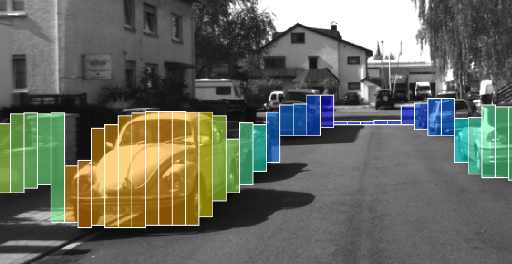

# Lesson 1-4 Working with Real PCD

This lesson will apply the segmentation and clustering techniques to real point cloud data from a self-driving car.

- Real-world challenges for Lidar
    * Environmental conditions: heavy rains, stand storms, and anything reflects/scatters laser
    * Ghost objects caused by highly reflective surfaces: water sprays from other cars, etc

- Downsampling
    * Sending out the entire point cloud data is too heavy for the vehicle internal network
    * Use **stixels**
        + Stixels are segments which represent sensor data in a compact fashion while retaining the underlying semantic and geometric properties
        + An example of stixels ([Ref](https://www.mathworks.com/matlabcentral/fileexchange/65347-stixel-world)). Use *height*, *width*, and *number* of rectangles to represent objects, instead of individual points.

### I. Downsampling

#### Voxel grid filtering

Voxel grid filtering will create a cubic grid, thinking about a voxel grid as a 3D tiny box, over the input point cloud data points. It will downsample the cloud by only leaving a single point per voxel grid, so the larger the grid length the lower the resolution of the point cloud.

- Two options for selecting that representative point per voxel
    * **Centroid** of the point distribution, i.e. *Spatial averaging* (slower but more accurate)
    * **Geometrical Center** of the voxel

#### Region of interest (ROI) filtering

ROI-based filtering defines a boxed region and any points outside the box will be removed.

- Two regions interested
    * An adequate mount of distance in front of and at back of the car, with an approximate width of the road
    * Outside the rooftop area