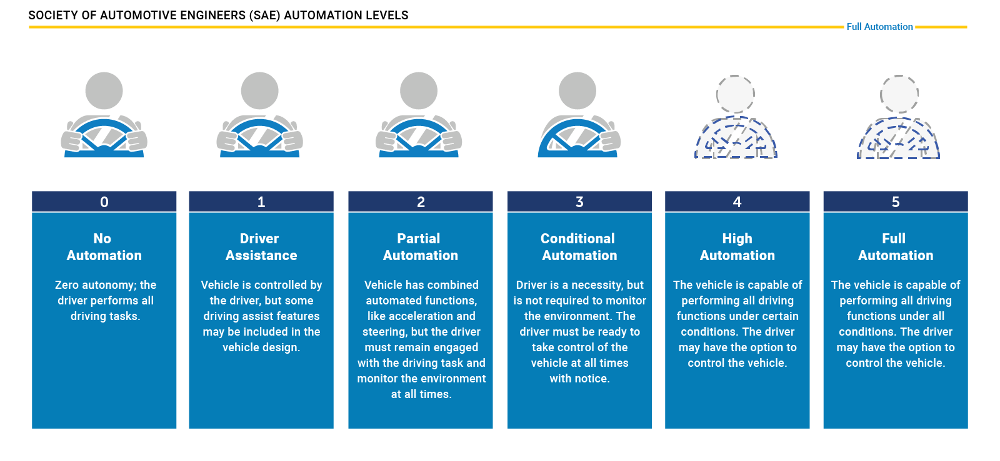
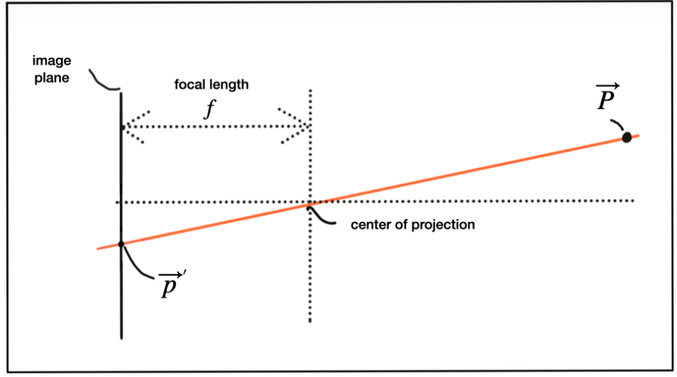
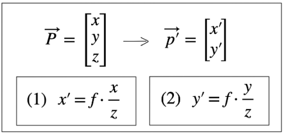
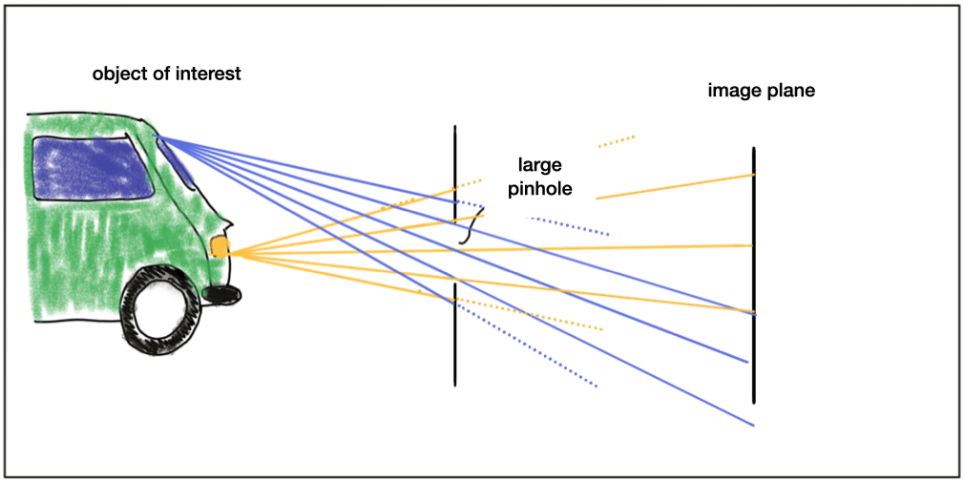
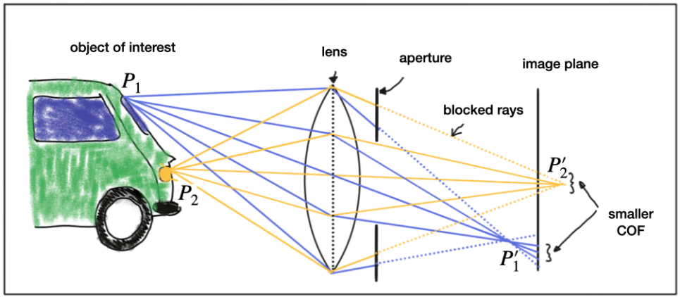
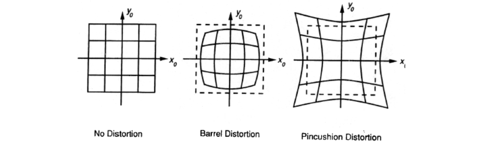
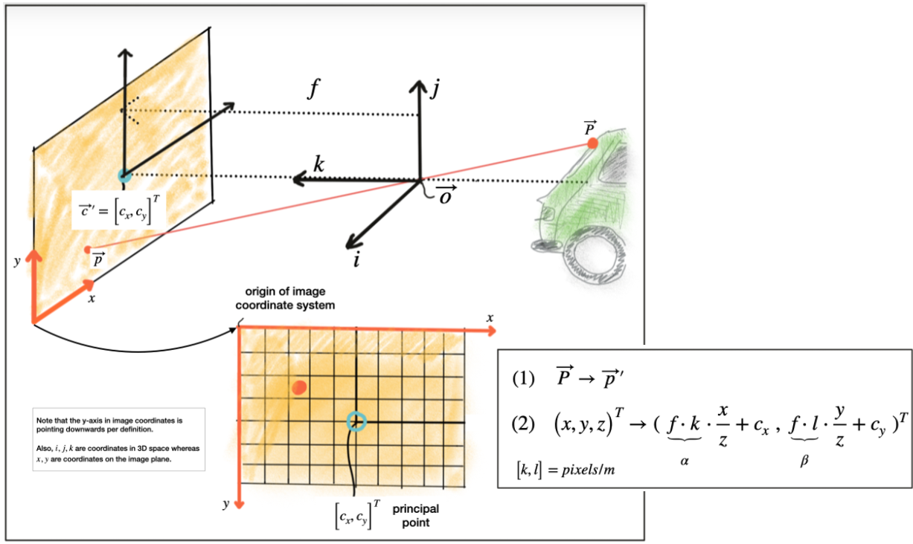
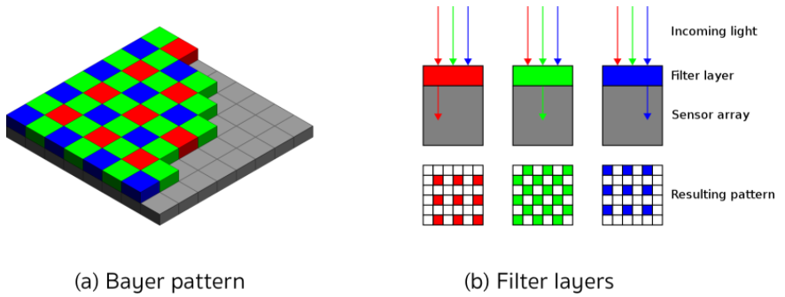

# Lesson 2-1 Autonomous Driving and OpenCV

This lesson will give an introduction about the autonomous driving and computer vision.

### I. Levels of Autonomous Driving

For years, there are many vehicles on the road equipped with *Advanced Driver Assistance Systems (ADAS)*, which assist the driver in various driving tasks, such as *Forward Collision Warning (FCW)*, *Adaptive Cruise Control (ACC)*, etc. But they only provide some degree of automation in a selected number of driving situations, e.g. highways, etc. The driver still must remain engaged in during the driving and monitor the environment.

For an automation Level 3 and above, the drivers are no longer required to monitor the environment, even though they must be available to take back the control at all times. Therefore, it means the responsibility for the driving tasks is with the car company/manufacturer from a legal viewpoint.

The graph below from the NHTSA website shows the *Levels of autonomous driving* defined by the SAE.

### II. Autonomous Vehicle Sensor Sets

The variety of the sensor sets for autonomous vehicles depends on the autonomy level, on the area of application, and engineering team's design.

- Uber ATG AVs
    * 7 cameras, 1 Lidar, inertial measurement units (IMUs), Radars, and storage/compute units

- Mercedes Benz AVs
    * cameras, Lidar and Radars, similar to Uber vehicles
    * feature a setup of synchronized cameras, which is able to measure depth information

- Tesla Autopilot
    * cameras with partially overlapping fields of view, forward-facing Radar (160m), and 360-degree ultrasonic sonar (8m)
    * no Lidar

#### Camera

- Limitations
    * poor performance at limited-vision scenarios, e.g. night, snow, heavy rain, fog, etc.

#### Radar

- Advantages
    * gives not only **distance** to the obstacle (time of flight), but also the **relative speed** (shifted frequency)
    * robust against adverse weather conditions, e.g. thick fog, heavy snow, etc.
    * best at identifying *large* objects with *good reflective properties*

- Limitations
    * poor performance on detecting *small* and *"soft"* objects, like humans and animals

#### Lidar

- Limitations
    * poor performance at adverse environment conditions, similar to the camera

#### Sensor Selection Criteria

|  Criteria  |  Lidar  |  Radar  |  Camera  |
|------------|---------|---------|----------|
| **Range**      | Meters to 200m | Meters to 200m | Only stereo camera setup can measure distance up to 80m |
| **Spatial Resolution** | High, 0.1 degree due to short wavelength laser | Cannot resolve small features | Defined by optics, pixel size of image and its signal-to-noise ratio |
| **Robustness in Darkness** | Excellent, due to active | Excellent, due to active | Reduced |
| **Robustness in Rain, Snow, Fog** | Limited, due to optical | Best | Limited, due to optical |
| **Classification of Objects** | Some level of classification by 3D point clouds | Not too much classification | Excellent at classification |
| **Perceiving 2D Structures** | N/A | N/A | The only sensor that is able to interpret traffic signs, lane markings, traffic lights |
| **Measure Speed** | Approximate speed by using successive distance measurement | Measure velocity by exploiting the Doppler frequency shift | Can only measure time to collision by observing the displacement of objects on the image plane |
| **System Cost** | More expensive | Compact and affordable | Compact and affordable |
| **Package Size** | Hard to integrate | Easily integrated | Easily integrated for mono cameras, but stereo camera setup is bulky |
| **Computational Requirements** | Little | Little | Significant |

### III. Camera Technology

#### Pinhole Camera

A model of a pinhole camera is shown below. An **object of interest** *P* can be mapped to the *p'* on the image plane by casting a beam through the **center of projection** until it hits the image plane.

**Image plane**: the photosensitive surface on the left

**Camera center**: the pinhole

**Focal length (f)**: the distance between camera center and image plane

In a 3D space, the relationship between *P* and *p'* is expressed by the following equations. So that we are able to compute the 2D position of an object on the image plane, in metrical coordinates and not pixel positions yet.

The problem with pinhole cameras is the amount of light passing through the pinhole is not sufficient to generate a decent image on the image sensor. Widening the pinhole can result in a brighter the image, but at the same time, rays of light from other parts of the object of interest would superimpose each other, leading to a **blurring effect**.

The solution to the blurring effect is using lens, which is able to capture multiple rays of light that emanate from the same point on the object of interest.

#### Lenses and Aperture

A properly sized and positioned lens refracts all rays of light that emanate from a point *P0* on an object such that they converge to a single point *p0'* in the image plane.

However, any points that are closer or farther away than *P0*, such as *P2*, appear **out of focus** on the image plane because the light rays don't converge in a point but rather in a circle in the image plane. This blurry circle is **circle of confusion (COF)**.

To reduce the blurring, an aperture can be used, which is a concentric opening of usually adjustable size. By reducing the diameter of aperture, the light rays on the outer edges are blocked which reduces the size of COF with the expense of low light sensitivity. Larger the aperture, brighter the images with a better signal-to-noise ratio.

Lenses introduce distortion into images depending on the lens type. The distortion most relevant to practice is called *radial distortion*. It is caused by the *focal length* of lens not being uniform over its diameter. Therefore, the magnification effect of the lens changes depending on the distance between the optical axis.

- Before analyzing the camera images, distortion effect must be removed or at least mitigated
    * **Calibration**: for each lens setup, compute the distortion parameters
    * **Rectification**: remove the distortion using the distortion parameters

#### Image transformation

Camera center is shown with a position *O* in space along with its own coordinate system with axes *i*, *j* and *k*, where *k* is pointing into the direction of the image plane. The position *c'* where *k* intersects the image plane is called the **principal point** and represents the center of the image coordinate system.

Transformation process:

1. Project the point *P* in space onto the image plane *p*, subtract the principle point coordinates so that the discrete image has its own coordinate system centered.

2. Move from metric to pixel coordinates using parameters *k* and *l* provided by the calibration procedure that convert meters to pixels.

Points in space are often described with *i*, *j*, *k* or *X*, *Y*, *Z*, while on the image plane, the coordinate axes are denoted as *x*, *y*.

#### Imagers and Bayer Pattern

- Two imagers (image sensors)
    * **CCD (Charge-Coupled Device)**
        + higher light sensitivity and less noise than CMOS, but these advantages disappeared
        + higher production cost, higher power consumption (x100 of CMOS), heat issue
    * **CMOS (Complementary Metal-oxide Semiconductor)**
        + lower cost, faster data readout, lower power consumption, higher noise immunity, smaller package

The light sensitive elements convert the amount of light to a number of electrons, and thus voltage. The sensing element is inherently color blind so that tiny filter elements are placed in front of each pixel.

The common way of arranging RGB filters is **Bayer Pattern**, which has alternating rows of red-green and green-blue filters. Since the human eye is more sensitive to green than to red or blue, the Bayer array has twice as many green color filters.

### IV. Exercise: OpenCV Library

OpenCV is a cross-platform computer vision library which provides a common infrastructure for computer vision applications and to accelerate the use of machine vision in science and engineering projects. Most OpenCV functions exist within the `_cv_` namespace. Usually, to shorten the code, the `using namespace cv` command is used in many applications.

- Main modules
    * **core:** core functionality
        + all basic object types and their operations
    * **highgui:** high-level GUI
        + user interfaces to display images, to take simple user input
    * **imgproc:** image processing
        + basic image transformations: filtering, geometric transformations, feature detection and tracking
    * **features2d:** 2D features framework
        + algorithms for detecting, describing and matching keypoints between images

OpenCV Documentation: https://docs.opencv.org/master/

#### Task 1: Matrix Datatype

The basic data type to store and manipulate images is `cv::Mat`. In the [create_matrix.cpp](../Camera/Lesson-2-Autonomous-Vehicles-and-Computer-Vision/The-OpenCV-Library/OpenCV_exercises/src/create_matrix.cpp), create a `cv::Mat` variable with three channels with a depth of 8-bit per channel `CV_8UC3`. Then, set the first channel to 255 `cv::Scalar(255, 0, 0)`. Display the image and it is a blue image. ([eab4fb8](https://github.com/fanweng/Udacity-Sensor-Fusion-Nanodegree/commit/eab4fb8426f7b263569086ef00999c22dfe0c74f))

#### Task 2: Manipulate Matrices

Using member function `cv::Mat::at<type_of_data>(row, col) = data` can change the value at particular point. In the [change_pixels.cpp](../Camera/Lesson-2-Autonomous-Vehicles-and-Computer-Vision/The-OpenCV-Library/OpenCV_exercises/src/change_pixels.cpp), loop through rows and columns to change the pixel values. ([da667f7](https://github.com/fanweng/Udacity-Sensor-Fusion-Nanodegree/commit/da667f7bc495895c63a64a21e62da49f3d2168df))

#### Task 3: Load and Handle Images

By calling `cv::imread`, we can load an image from file and assign it to a `cv::Mat` variable. In the [load_image_3.cpp](../Camera/Lesson-2-Autonomous-Vehicles-and-Computer-Vision/The-OpenCV-Library/OpenCV_exercises/src/load_image_3.cpp), images are loaded and pushed into the `vector<cv::Mat>`. We simply skip the Image No.7 when displaying. ([4130ee2](https://github.com/fanweng/Udacity-Sensor-Fusion-Nanodegree/commit/4130ee244b150759453d7f5a05a76388516bcbad))