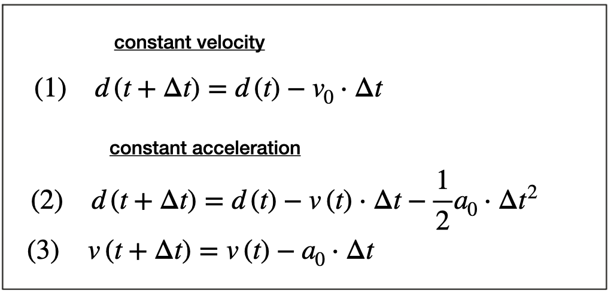
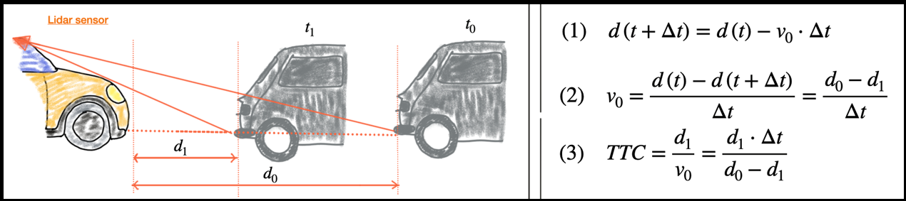
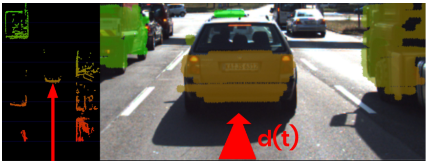
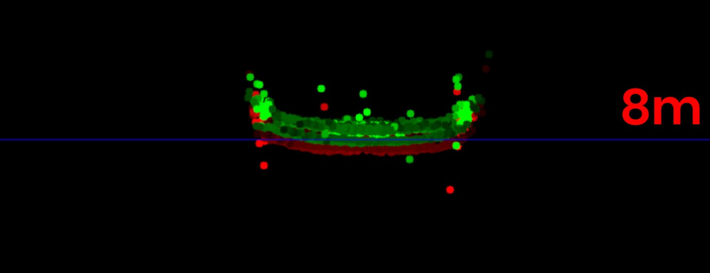

# Lesson 2-2 Collision Detection System

This lesson will introduce the basics of the collision detection model, will show how to estimate the time-to-collision (TTC) using Lidar or camera.


### I. Collision Detection

A Collision Avoidance System (CAS) is an active safety feature that either warns the driver or apply the brakes autonomously in the event of am imminent collision with an object in the path of driving. CAS continuously estimates the TTC and acts when the TTC falls below a threshold.

- Two assumption models to compute the TTC
    * **Constant Velocity Model (CVM):** relative velocity between two objects is constant
        + need to measure *distance* to the preceding object with a constant *time interval* between measurements
        + much simpler, and the following course will use this
    * **Constant Acceleration Model (CAM):** relative acceleration between two objects is constant
        + complex but more accurate




### II. Estimate with Lidar

Lidar measures the distance to the closest points on the preceding vehicle. Based on the CVM, we have the following equations to compute the *relative velocity* and the *TTC*.



In order to derive a stable TTC measurement from the given point cloud, we need to 1) remove points of the road surface and 2) remove measurements with low reflectivity. The following image shows the point cloud after preprocessing.



The code example introduces a data structure `LidarPoint` as below. We need to find the distance to the closest Lidar point in the path of driving. In the figure below, the tailgate of the preceding vehicle is measured at *t0* (green) and *t1* (red). Even though Lidar is a reliable sensor, erroneous measurement will still occur, e.g. the individual points outside the tailgate measured. We will perform a more robust calculation of minimum distance dealing with those outliers and also look at TTC estimation from camera.

```c++
struct LidarPoint {
    double x, y, z; // point position in meter, x (forward), y (left), z (up)
    double r;       // point reflectivity ranging between [0, 1]
};
```



In the [compute_ttc_lidar.cpp](../Camera/Lesson-3-Engineering-a-Collision-Detection-System/Estimating-TTC-with-Lidar/TTC_lidar/src/compute_ttc_lidar.cpp), filter out the points outside the ego-lane, iterate point clouds for *t0* and *t1*, find out the closest points respectively and compute the TTC. ([acd6ff3](https://github.com/fanweng/Udacity-Sensor-Fusion-Nanodegree/commit/acd6ff380dad753208ca899a5ca389aba2814a0f))
