# Lesson 2-3 Tracking Image Features

This lesson will show how to identify and track reliable and stable features through a sequence of images.
1. Locate keypionts (point of interest, salient point)

### I. Intensity Gradient and Filtering

The majority of the keypoint types is the distribution of brightness information over the image. High intensity gradient indicates the brightness changes rapidly, and those places might therefore be suitable keypoints.

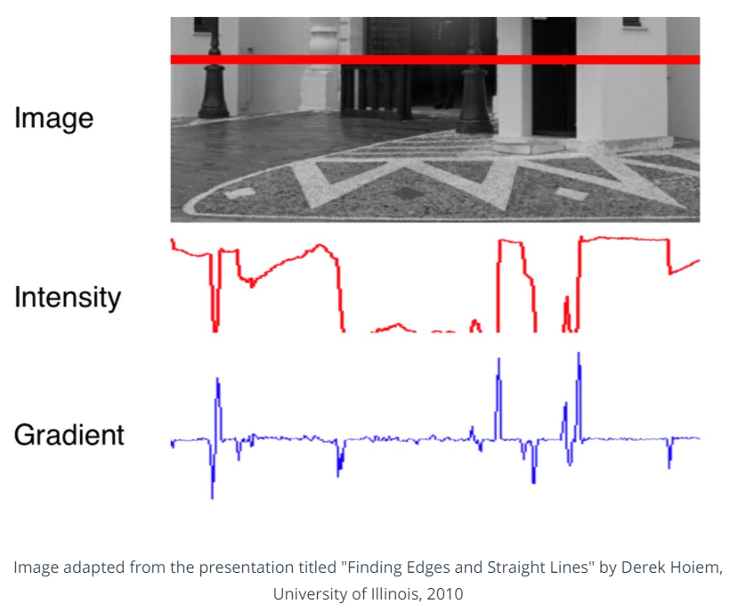

Mathematically, the gradient is the partial derivative of the image intensity into both *x* and *y* direction. The **approximation of gradient** would be the intensity differences between neighboring pixels, divided by the distance between those pixels. We can also compute the **direction** as well as the **magnitude** of the intensity gradient vector.

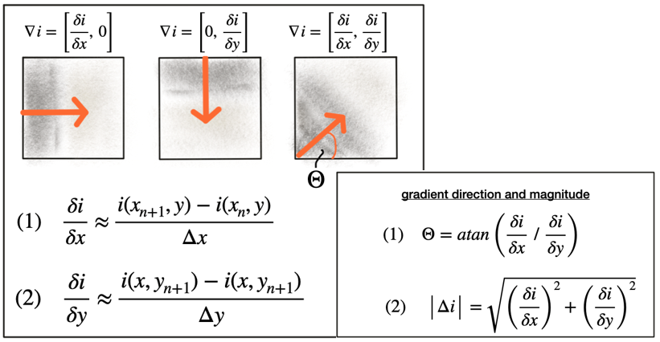

`Sobel` operator is one of the most famous approaches to compute the gradient. They are 3x3 kernels, as small integer-valued filters.

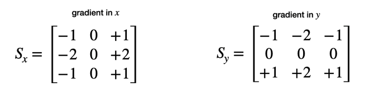

#### Gaussian Filtering

Before computing the intensity gradient, we should apply noise filtering to get an accurate result. **Gaussian filter** is shifted over the image and combined with the intensity values beneath it. Two parameters can be adjusted:

1. **Standard deviation:** controls the spatial extension of the filter in the image plane. Larger the standard deviation, wider the area which is covered by the filter

2. **[Kernel size](https://docs.opencv.org/3.4/d4/dbd/tutorial_filter_2d.html):** defines the number of pixels around the center location will contribute to the smoothing operation

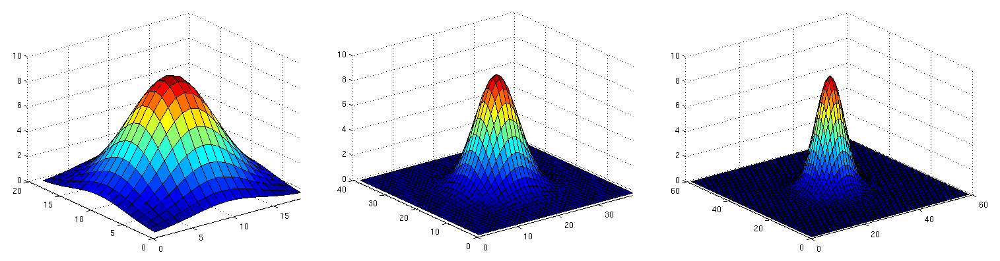

Gaussian filtering works by assigning each pixel a weighted sum of the surrounding pixels based on the heigh of Gaussian curve at each point. The largest contribution will come from the center pixel itself. The steps like:

1. Create a filter kernel with the desired properties (e.g. Gaussian smoothing or edge detection)
2. Define the anchor point within the kernel (usually the center position) and place it on top of the first pixel of the image
3. Compute the sum of the products of kernel coefficients with the corresponding image pixel values beneath
4. Place the result to the location of the kernel anchor in the input image
5. Repeat the process for all pixels over the entire image.

#### Exercise: Image Filters and Gaussian Smoothing

In the [gaussian_smoothing.cpp](../Camera/Lesson-4-Tracking-Image-Features/Intensity-Gradient-and-Filtering/gradient_filtering/src/gaussian_smoothing.cpp), before applying `cv::filter2D()`, the kernel coefficients must be normalized. ([6854a85](https://github.com/fanweng/Udacity-Sensor-Fusion-Nanodegree/commit/6854a85edb63e91aa7677477af159d3963b0d2f7))

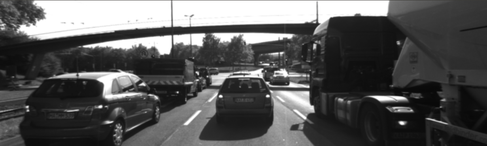

#### Exercise: Computing Intensity Gradient

In the [gradient_sobel.cpp](../Camera/Lesson-4-Tracking-Image-Features/Intensity-Gradient-and-Filtering/gradient_filtering/src/gradient_sobel.cpp), create the sobel kernels and apply the filters to *x* and *y* directions respectively. ([73a5b01](https://github.com/fanweng/Udacity-Sensor-Fusion-Nanodegree/commit/73a5b013c6fc2f664c999581902742bd7aa11e35))

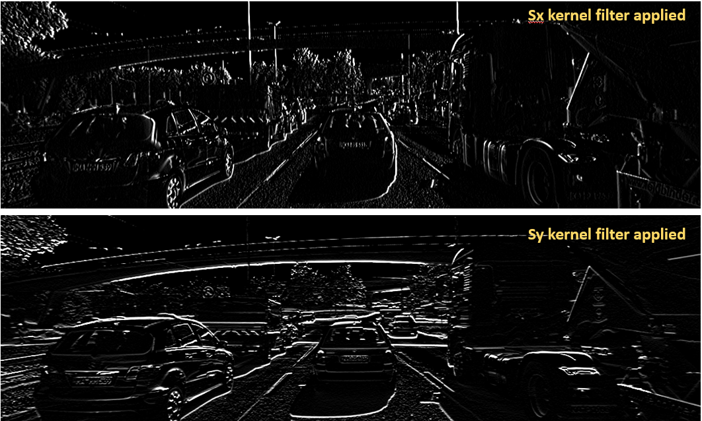

In the [magnitude_sobel.cpp](../Camera/Lesson-4-Tracking-Image-Features/Intensity-Gradient-and-Filtering/gradient_filtering/src/magnitude_sobel.cpp), the processing pipeline is: convert the image to gray scale -> smooth it using `cv::GaussianBlur()` -> apply `cv::filter2D()` with sobel kernels in both *x* and *y* directions -> calculated the magnitude for each pixel based on the *x*/*y* gradient. ([4d5fc96](https://github.com/fanweng/Udacity-Sensor-Fusion-Nanodegree/commit/4d5fc96e4e3ac05f2c064644c433f0f17fa1034f))

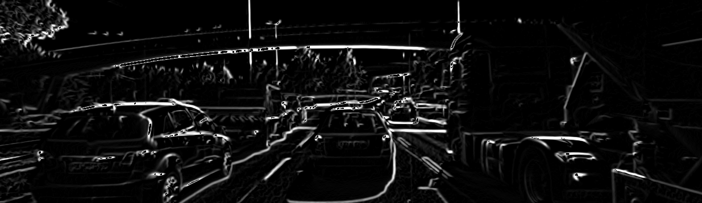

### II. Keypoint Tracking

**Keypoint detector:** choose points from an image based on *a local maximum* of a function, such as the "cornerness" metric for Harris Corner Detector.

**Descriptor:** a vector of values, which describes the image patch around a keypoint.

#### 1. Harris Corner Detection

The idea of keypoint detection is to detect a unique structure in an image that can be precisely located in both coordinate directions. As discussed in the previous section, corners are ideally suited for this purpose. In order to locate a corner, we consider how the content of the window would change when shifting it by a small amount. Such change is described by the *sum of squared differences (SSD)*.

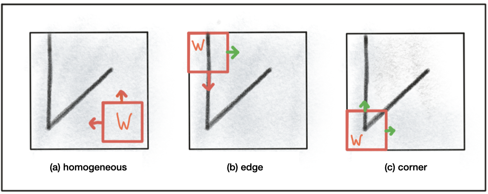

A *covariance matrix* `Hw` is part of the calculation result of that change. The matrix `Hw` can be visualized as an eclipse, whose axis length and direction are given by its **eigenvalues** and **eigenvectors**. For *Harris Detector*, we can derive a corner response measure at every pixel location with the factor *k* being an empirical constant (0.04 ~ 0.06).

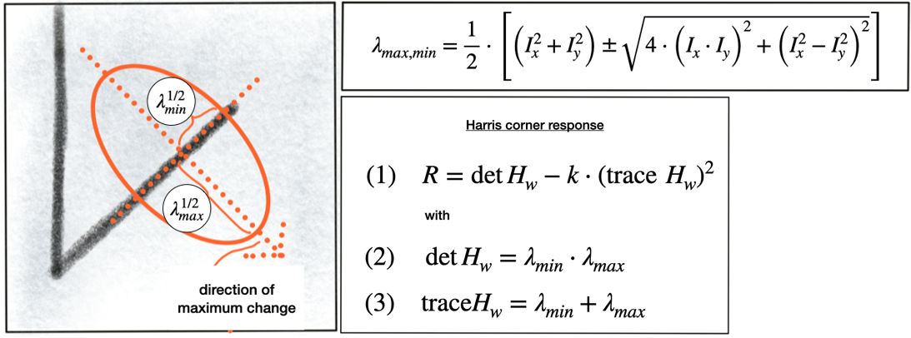

#### Exercise: Harris Corner Response

After getting Harris corner response, it is time to perform a **non-maxima suppression (NMS)** to:
1. ensure the pixel with maximum corner response in a local neighborhood
2. prevent corners from being too close to each other

In the [cornerness_harris.cpp](../Camera/Lesson-4-Tracking-Image-Features/Harris-Corner-Detection/cornerness_harris/src/cornerness_harris.cpp), first, the Harris Corner Response matrix is calculated. Then we locate a local maxima in the response matrix and perform NMS to it. ([2776d68](https://github.com/fanweng/Udacity-Sensor-Fusion-Nanodegree/commit/2776d68e13deaf24e7aebf0924803ed07e2069db))

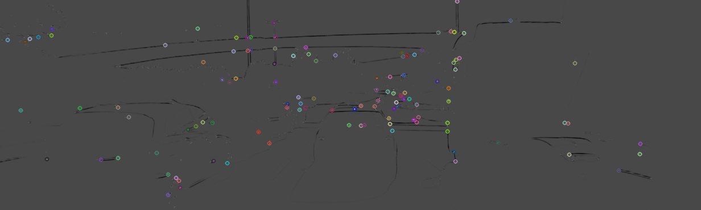

#### 2. Invariance to Photometric and Geometric Changes

Four basic transformation types we need to think about when selecting suitable keypoint detector:
1. Rotation
2. Scale change
3. Intensity change
4. Affine transformation

Harris detector is robust under rotation and additive intensity shifts, but sensitive to scale change, multiplicative intensity shifts (i.e. change in contract), and affine transformations.

- Classic detectors
    * aim at maximizing the detection **accuracy**
        + Harris Corner Detector
        + Good Features to Track (Shi-Tomasi)
        + Scale Invariance Feature Transform (SIFT)
        + Speeded Up Robust Features
- Modern detectors
    * aim at **speed**, **real-time** applications
        + Features from Accelerated Segment Test (FAST)
        + Binary Robust Independent Elementary Features ([BRIEF](https://stackoverflow.com/questions/29870726/brief-implementation-with-opencv-2-4-10))
        + Oriented FAST and Rotated BRIEF ([ORB](https://docs.opencv.org/3.4/d1/d89/tutorial_py_orb.html))
        + Binary Robust Invariant Scalable Keypoints (BRISK)
        + Fast Retina Keypoint (FREAK)
        + KAZE
        + Accelerated-KAZE ([AKAZE](https://docs.opencv.org/3.4/db/d70/tutorial_akaze_matching.html))

#### Exercise: Shi-Tomasi vs. FAST

In the [detect_keypoints.cpp](../Camera/Lesson-4-Tracking-Image-Features/Overview-of-Popular-Keypoint-Detectors/detect_keypoints/src/detect_keypoints.cpp), `cv::FastFeatureDetector::create()` a pointer to the `cv::FastFeatureDetector` object, call its `detect()` member function to extract the keypoints. Compare the number of keypoints, keypoints distribution, and processing speed with Shi-Tomasi detector. ([4d09290](https://github.com/fanweng/Udacity-Sensor-Fusion-Nanodegree/commit/4d09290b6d1227e173b07e49d20637dbf5d0f8a9))

#### 3. Detectors and Descriptors

Descriptor provides a distinctive information on the surrounding area of a keypoint. It helps assigning similar keypoints in different images to each other.

- **Gradient-based** descriptor: SIFT
    * based on Histograms of Oriented Gradients (HOG)
        + the idea is to describe the structure of an object by the distribution of its intensity gradients in a local neighborhood
    * advantages
        + robust at identifying objects even among clutter and under partial occlusion
        + invariant to uniform changes in scale, to rotation, to changes in both brightness and contrast
        + partially invariant to affine distortions
    * disadvantages
        + low speed due to computing the intensity gradients
        + heavily patented, not free to use

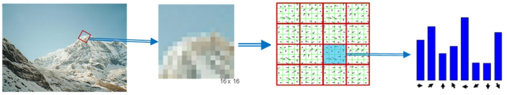

- **Binary** descriptor: BRISK
    * solely rely on the intensity information, and encode the information around a keypoint in a string of binary numbers
    * components
        + **sampling pattern:** describes where sample points are located around the keypoint
        + **orientation compensation:** removes the influence of rotation of the image patch around the keypoint
        + **sample-pair selection:** generates pairs of sample points that are compared against each other with regard to their intensity values

- OpenCV for detectors and descriptors
    * [FeatureDetector](https://docs.opencv.org/2.4/modules/features2d/doc/common_interfaces_of_feature_detectors.html#featuredetector-create) and [DescriptorExtractor](https://docs.opencv.org/2.4/modules/features2d/doc/common_interfaces_of_descriptor_extractors.html#descriptorextractor-create) share a few common algorithms
    * [Overview](https://docs.opencv.org/2.4/modules/features2d/doc/feature_detection_and_description.html) of feature detection and descriptor classes

#### Exercise: HOG vs. Binary

In the [describe_keypoints.cpp](../Camera/Lesson-4-Tracking-Image-Features/Gradient-based-vs-Binary-Descriptors/describe_keypoints/src/describe_keypoints.cpp), add HOG-based algorithm *SIFT* to compute the keypoints, compare the processing speed, number of keypoints, and the distribution of the keypoints with the Binary algorithm *BRISK*. ([c51971b](https://github.com/fanweng/Udacity-Sensor-Fusion-Nanodegree/commit/c51971b4aaf6f42320d716bf54655c925b3fb2a0))

#### 4. Descriptor Matching

Once locating and describing a set of keypoints in a sequence of images, the next step is to find the best fit for each keypoints in successive frames. We need to implement a suitable similarity measures to uniquely assign keypoint pairs. One simple measure is to compute the distance between two descriptors.

- Sum of Absolute Differences (SAD)
    * SAD norm is also referred as L1-norm
- Sum of Squared Differences (SSD)
    * SSD norm is also referred as L2-norm
    * better for gradient-based descriptors
- Hamming Distance (HD)
    * best for binary descriptors who consist only `0` or `1`
    * compute by using `XOR` function
        + return `0` if two bits are identical; return `1` if two bits are different
        + sum of all `XOR` operations is simply the number of differing bits between both descriptors

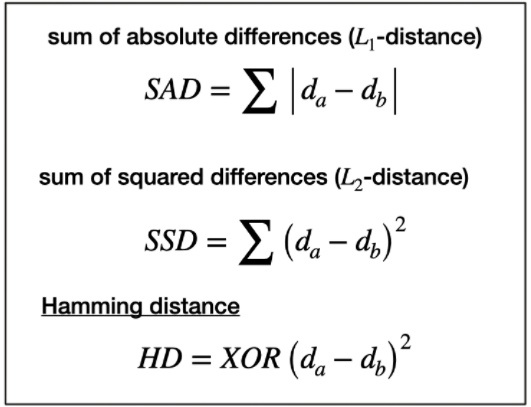

- Methods to find matching pairs based on distance measures
    * Brutal force matching
        + for a given keypoints from the first image, calculates the distances to every keypoint in the second image
    * Fast library for approximate nearest neighbors (FLANN)
        + build KD-tree to search for potential matching pairs efficiently instead of an exhaustive search

Both matching algorithms accept a descriptor distance threshold *T* which is used to limit the number of matches to the "good" ones, and discard matches where the respective pairs are no correspondences. False matches are inevitably existing, to counteract that, we use **cross checking matching**. It applies the matching procedure in both directions, and keep only those matches whose best match in one direction equals the best match in the other direction.

#### Exercise: Brutal Force vs. FLANN

In the [descriptor_matching.cpp](../Camera/Lesson-4-Tracking-Image-Features/Descriptor-Matching/descriptor_matching/src/descriptor_matching.cpp), implement the FLANN matching and the k-nearest-neighbor *KNN* selection (keeping the best k matches per keypoint). Compare the results with Brutal Force matching with nearest-neighbor *NN* selection (keeping only the best match). ([720b82d](https://github.com/fanweng/Udacity-Sensor-Fusion-Nanodegree/commit/720b82d618cb24f9c9b352701e7b704438cbe9d3))

