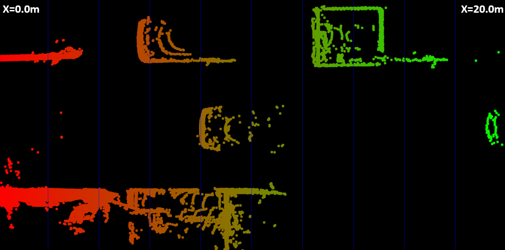
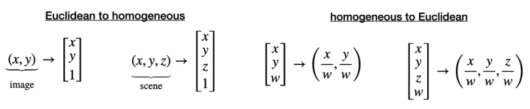
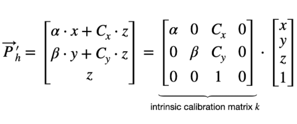
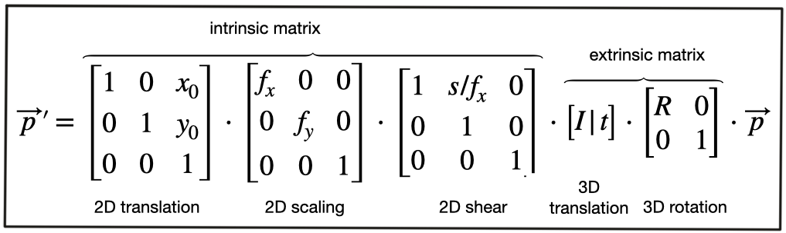
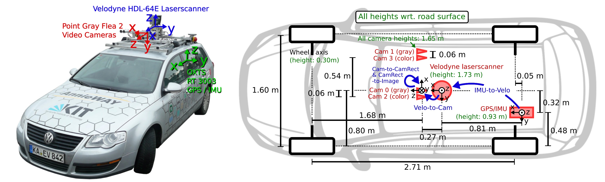
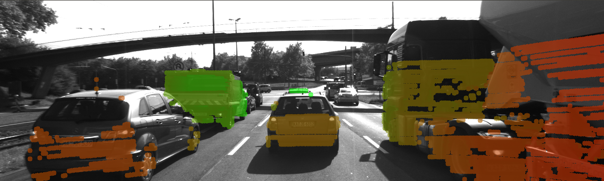
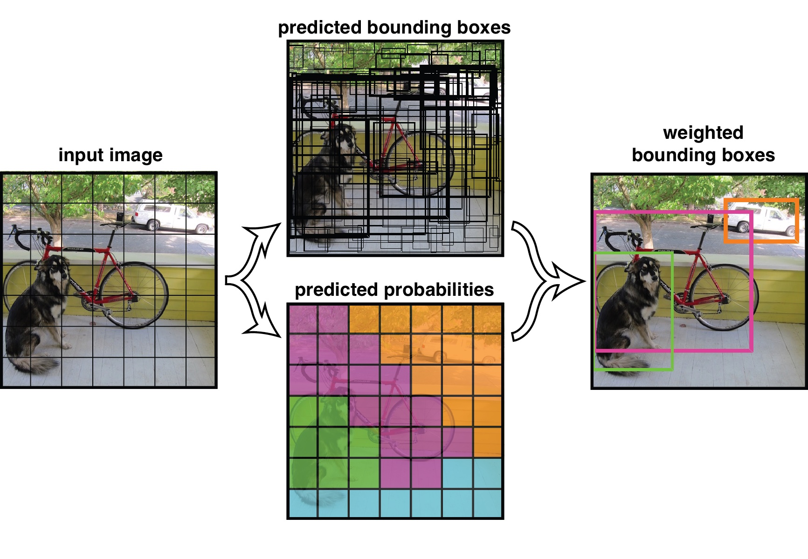
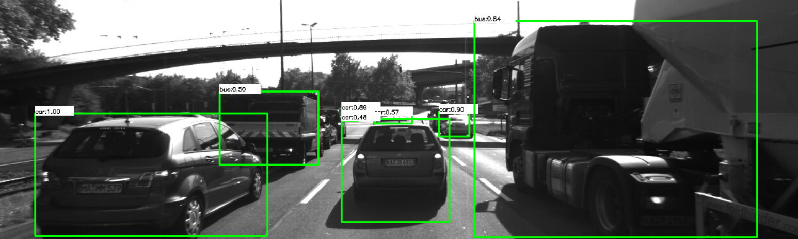
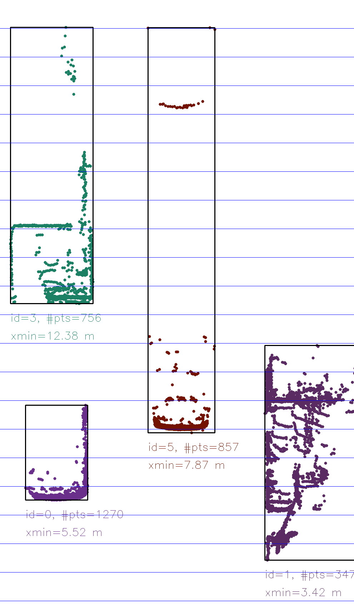

# Lesson 2-4 Combining Camera and Lidar

Single-sensor approach is limited by the fact that each sensor has its own weakness in some situation. This lesson will show how to combine 2D camera image data and 3D Lidar data to improve the tracking process results.

### I. Project Lidar Points to Camera Images

Velodyne Lidar sensor is synchronized with the forward-looking camera. The captured point cloud data needs some processing to remove the points on the road surface.

#### Exercise: Show Lidar point in a top view

In the [show_lidar_top_view.cpp](../Camera/Lesson-6-Combining-Camera-and-Lidar/Lidar-to-Camera-Point-Projection/lidar_to_camera/src/show_lidar_top_view.cpp), remove the Lidar points representing the road surface by eliminating the points below a certain height `roadSurfaceLvl` in z-axis. Draw the rest of Lidar points in a gradient color from red (x = 0.0m) to green (x = 20.0m). ([9b25ab0](https://github.com/fanweng/Udacity-Sensor-Fusion-Nanodegree/commit/9b25ab06b20bf1c51b3580576098f9bc01265a75))

#### Homogeneous coordinates

We can use the projection equation introduced in the [Lecture 2-1](./lec2-1-av-and-opencv.md) to map 3D points onto 2D image. But the equations involve a division by *z*, which makes them non-linear, and thus prevents us from transforming them into a convenient matrix-vector form.

To avoid the problem above, we change the original **Euclidean coordinate** system to **Homogenous coordinate** system. Transformation between the two systems is *non-linear*, but the equations are *linear, and thus can be expressed as simple matrix-vector multiplications.

- **Intrinsic Parameters**
    * now projection equations are arranged in matrix-vector form with camera parameters
    * described by the matrix *k*

- Mapping between vehicle coordinate system and camera coordinate system generally needs three components
    * **Translation**
        + describes the linear shift of a point *P* to a new location *P'* by adding a vector *t*
    * **Scale**
        + multiplies the components with a scale vector *s*
        * scale component is integrated into the intrinsic matrix *k*, and is no longer part of the extrinsic matrix
    * **Rotation**
        + rotates in counter-clockwise direction (mathematically positive) by multiplication of *R*

- **Extrinsic Parameters**
    * matrix *t* and *R*

With homogenous coordinates, we can use the following equation to transform points between two systems.

#### KITTI sensor setup

KITTI vehicle has a sensor setup with two forward-facing cameras, a roof-mounted Velodyne Lidar, and an IMU.

The calibration files with intrinsic and extrinsic parameters are available with datasets downloaded from KITTI website. `calib_velo_to_cam.txt` contains the extrinsic parameters *R* and *T* matrices. `calib_cam_to_cam.txt` provides the intrinsic parameters `P_rect_xx` as the *k* matrix and rotation rectifying matrix `R_rect_00` that makes image planes co-planar. The equation to project 3D Lidar points X in space to a 2D image point Y:

> Y = P_rect_xx * R_rect_00 * (R|T)_velo_to_cam * X

#### Exercise: Project Lidar points to camera image

In the [project_lidar_to_camera.cpp](../Camera/Lesson-6-Combining-Camera-and-Lidar/Lidar-to-Camera-Point-Projection/lidar_to_camera/src/project_lidar_to_camera.cpp), loop over the Lidar points, convert the 3D points into homogenous coordinates. Then apply the projection equation to the homogenous coordinates resulting the coordinates on a 2D image. Transform the coordinates back to the Euclidean world. [d5a3d78](https://github.com/fanweng/Udacity-Sensor-Fusion-Nanodegree/commit/d5a3d785f13d7322198b2811b89122e465d51934)

Some of the Lidar points are outside the ROIs, for example, behind the vehicle, too far ahead to the vehicle, too far on the left/right of the vehicle, road surface points. They need to be filtered out. [5eede5c](https://github.com/fanweng/Udacity-Sensor-Fusion-Nanodegree/commit/5eede5c62e11617604aa1d952144fd0fac86ba5d)

The resulting overlay images looks like below. The red-ish color indicates the part of object is closer to the vehicle.

### II. Object Detection with YOLO

In the [Lecture 2-3](./lec2-3-track-image-features.md), we already detect and match keypoints on camera images. But to compute a TTC estimate reliably, the keypoints on the preceding vehicle must be isolated from the points on the road surface, stationary objects, or other vehicles. One way to achieve that goal is using algorithm to identify the objects in the scene and put a set of bounding boxes around them. So we can easily associate keypoint matches to the vehicle and calculate a stable TTC estimate.

In the past, histograms of oriented gradients (HOG) and support vector machine (SVM) methods were used for object detection. Now deep-learning methods come, YOLO (You Only Look Once) is one of the algorithms which is capable to detect a range of various objects, including vehicles, pedestrians, etc. A single neural network is applied to the full image. This network divides the image into regions and predicts bounding boxes and probabilities for each region. These bounding boxes are weighted by the predicted probabilities.

#### Exercise: YOLOv3 workflow

In the [detect_objects_2.cpp](../Camera/Lesson-6-Combining-Camera-and-Lidar/Object-Detection-with-YOLO/detect_objects/src/detect_objects_2.cpp), `confThreshold` is used to remove all bounding boxes with a lower predicted confidence score value. The *non-maximum suppression* is controlled by the `nmsThreshold`. The input image size is set to `cv::Size(608, 608)` to have a more accurate prediction. ([2c99250](https://github.com/fanweng/Udacity-Sensor-Fusion-Nanodegree/commit/2c992506ad7d707797e8cd13f418167adeaad8b5))

### III. Create 3D Objects

This section will combine 2D image features, 3D Lidar points and 2D YOLO-based vehicle bounding boxes to produce a stable 3D trajectory of a preceding vehicle.

- Group Lidar points that belong to the same object in the scene
    * YOLOv3 framework detects a set of objects in a camera image, and encloses them in boxes with class labels
    * Loop through all Lidar points, check if they belong to a specific bounding box (ROI)
    * If within the ROI, add the point into the `BoundingBox.lidarPoints` data structure
    * If ROI boxes have overlaps, shrink their sizes slightly

#### Exercise: Group Lidar points and create 3D objects

In the [cluster_with_roi.cpp](../Camera/Lesson-6-Combining-Camera-and-Lidar/Creating-3D-Objects/cluster_with_roi/src/cluster_with_roi.cpp), find the Lidar points enclosed within multiple bounding boxes, and exclude them from further processing. ([8c6edc7](https://github.com/fanweng/Udacity-Sensor-Fusion-Nanodegree/commit/8c6edc729a4e4ebdc928c2c4a75ac8a189eb3145))

Then displaying information about all bounding boxes: distance to closest points in x-axis, object width and height, number of supporting Lidar points. ([2daafd2](https://github.com/fanweng/Udacity-Sensor-Fusion-Nanodegree/commit/2daafd2eba567226a12e01938b33da5d29e4ca19))

