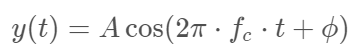
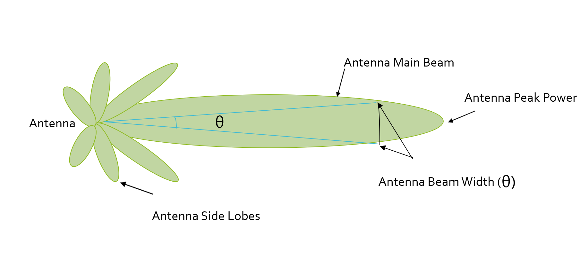

# Lecture 3-1 Radar Principles

Radar is very efficient with a low cost and small footprint. It is capable to determine the targets at long range with accurate velocity and spatial information. Additionally, its sensitivity in dark and poor weather conditions also helps to cover the domains where Lidar or camera may fail.

- Operation
    * transmit electromagnetic waves, and receive reflected wave from targets
- Construction
    * **radar dome** or **radome**: enclosure that protects a radar antenna, and it is effectively transparent to radio waves
    * **radar PCB**: analog hardware that includes transceiver, antenna
    * **DSP PCB**: DSP unit
- Comparison with Lidar
    * pros: operates in the bad weathers, low-cost, accurate velocity detection
    * cons: lower resolution

### I. Signal Properties

- Wavelength
    * physical length from one point of a wave to the same point on the next wave
    * wavelength = speed_of_light / frequency
- Frequency
    * first derivative of the phase with respect to the time
    * automotive radar operates at W band (76GHz - 81GHz), a.k.a mmWave
- Bandwidth
    * difference between the highest and the lowest frequency components
- Amplitude
    * strength of the signal
    * automotive radar operates at max of 55dBm output power (316W)
- Phase
    * a particular point in time on the cycle of a waveform, measured as an angle in degrees

#### General equation of a wave

### II. FMCW

Frequency-Modulated Continuous Wave (FMCW) radar radiates continuous transmission power. Its signal frequency increases/decreases with time. Two most common waveform patterns for FMCW:
- sawtooth (upramps)
- triangular (both upramps and downramps)

**Chirp** is defined by its **slope**. The slope is given by its chirp frequency bandwidth (B, y-axis) and its chirp time (T, x-axis). The range resolution requirement decides the *B*, whereas the maximum velocity capability of a radar is determined by the chirp time *T*.

#### Antenna details

The antenna pattern below shows the strength of the relative field emitted by the antenna. The *beamwidth* determines the field of view for the radar sensor. A wider beamwidth will sense the target in other lanes. If the requirement is to just sense the targets in its own lane, the beamwidth needs to be small enough. Antenna *sidelobes* could generate false alarms and pick interference from undesired direction. Thus, it is critical to suppress the sidelobe strength level.

