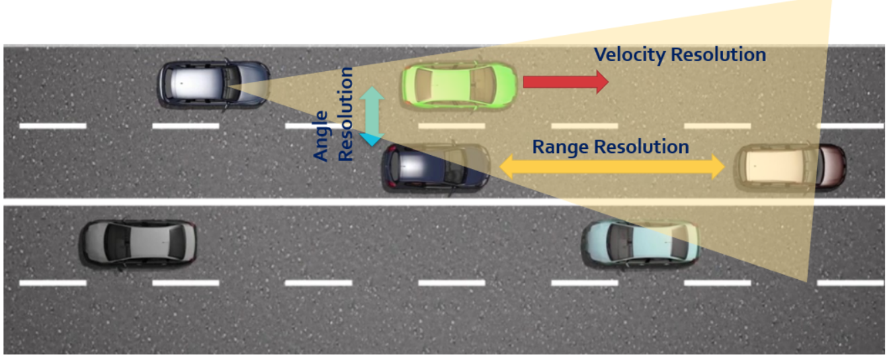
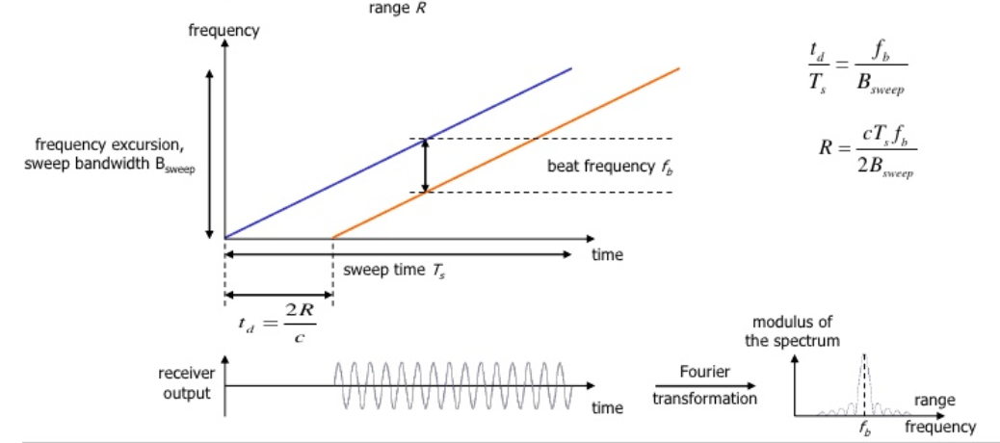
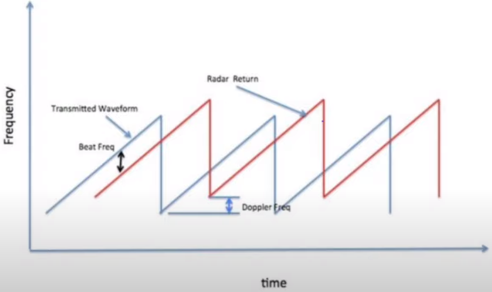
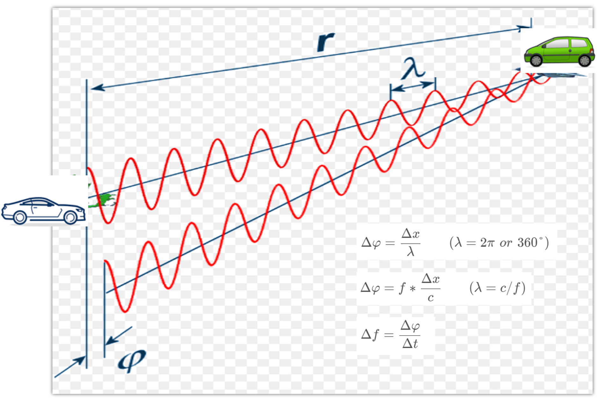
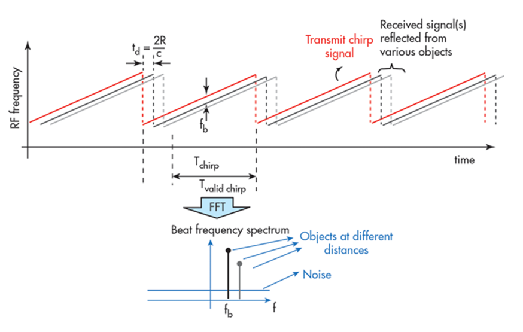
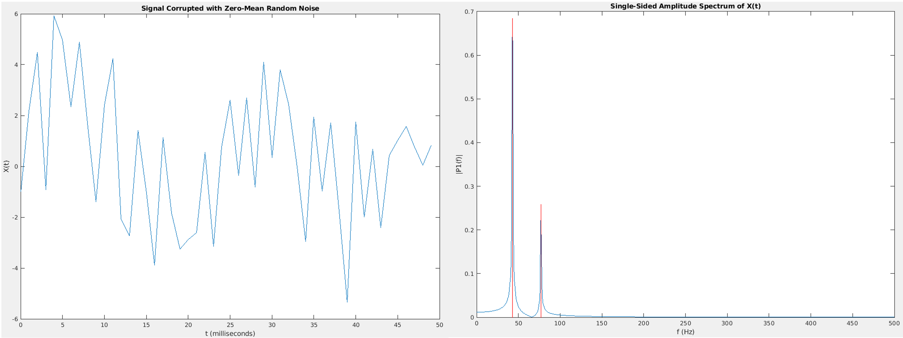
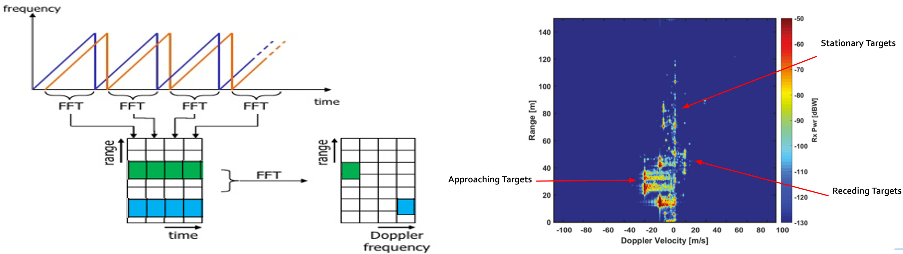
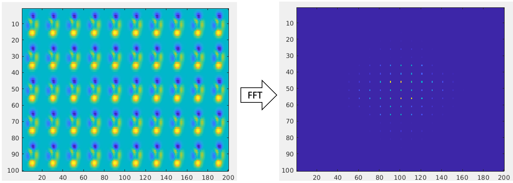

# Lecture 3-2 Range Doppler Estimation

In this lesson, we will learn the basics of range and velocity estimation using doppler and Fourier transformation techniques.



The distance, angle and velocity differences between two targets determine if the radar can resolve them.

- Range resolution
    * to distinguish between two targets that are close to each other
    * solely rely on the *chirp frequency bandwidth*: `dres = c / (2 * B)`
- Velocity resolution
    * if two targets travel in different velocities, radar still can resolve them even if they have the same range
    * rely on the *number of chirps*, higher the number, higher the resolution but also longer processing time
- Angle resolution
    * to separate two targets spatially when they have the same range and the same velocity


### I. Range Estimation

In general, for an FMCW radar system, the chirp (sweep) time should at least 5 to 6 times of the round trip time. We can use a factor of 5.5 for this lesson: `Ts = 5.5 * 2 * RadarMaxRange / c`.

By measuring the received frequency and subtracting it from the radar's ramping frequency, we can get the **beat frequency**, `Fb = Framping - Freceived`. Thus, range can be estimated by `R = c * Ts * Fb / (2 * Bsweep)`.

Here, `R` is range, `c` is speed of light, `Ts` is the chirp time, `Fb` is the beat frequency, `Bsweep` is the chirp bandwidth.



#### Exercise: range calculation

Using the MATLAB code ([36f29e1](https://github.com/fanweng/Udacity-Sensor-Fusion-Nanodegree/commit/36f29e1b2bba07c4db245c82ca68925658e30bec)), I calculated the ranges [0.0 m, 12.1 m, 143.0 m, 264.0 m] of four targets with measured beat frequencies [0 MHz, 1.1 MHz, 13 MHz, 24 MHz] respectively.

```matlab
>> range_cal
    0   12.1000  143.0000  264.0000
```


### II. Doppler Estimation

Doppler effect indicates that the reflected frequency is higher when the target is approaching whereas a receding target will reflect lower frequency wave. The doppler shift is directly proportional to the velocity of the target: `Fd = 2 * vr / lambda`.

Here, `Fd` is the doppler shift, `vr` is the relative velocity of the target, `lambda` is the wavelength of signal.

With a moving target, the **beat frequency** now depends on both components: `Fr` (frequency delta due to range) and `Fd` (frequency shift due to velocity).



Although, in the case of automotive radar, the `Fd` is very small in comparison to the `Fr`. Hence, we measure the doppler shift by using **rate of change of phase across multiple chirps**: `d(f) = d(phase) / d(t)`. And the phase change: `d(phase) = d(x) / lambda = f * d(x) / c`.

Here, `d(x)` is the path changed between target and radar, `lambda` is wavelength of radar signal, `f` is the frequency of radar signal, `c` is speed of light.



#### Exercise: velocity calculation

Using the MATLAB code ([464b765](https://github.com/fanweng/Udacity-Sensor-Fusion-Nanodegree/commit/464b7652103bd285ccac7f8171e8d60975884075)), I calculated the relative velocities [5.84 m/s, -8.76 m/s, 21.42 m/s, -5.84 m/s] of four target with doppler frequency shifts [3 KHz, -4.5 KHz, 11 KHz, -3 KHz] respectively.

```matlab
>> velocity_cal
    5.8442   -8.7662   21.4286   -5.8442
```


### III. Fast Fourier Transform (FFT)

FFT converts the signal from *time domain* to *frequency domain*, i.e. multiple components for a signal in the time domain can be separated by FFT. It is important for the spectral analysis and to determine the shifts in frequency due to range and doppler.



#### Exercise: FFT

Using the MATLAB code ([4fce1f4](https://github.com/fanweng/Udacity-Sensor-Fusion-Nanodegree/commit/4fce1f45d0f4523c8f8d659bd49d77079a11c485)), I constructed a signal with two frequency components plus random noise. Then FFT was used to extract the frequency components of the signal buried in noise, which are about 45Hz and 80Hz.




### IV. 2D FFT

First range FFTs are run for every sample on each chirp. Since each chirp is sampled `N` times, it will generate a range FFT block of `N * Num_of_Chirps`. These FFT blocks are also called **FFT bins**. The output of the first FFT gives the *beat frequency*, *amplitude*, *phase* for each target. The phase varies as moving from one chirp to another (i.e. one bin to another on each row) due to target's small displacement.

Second doppler FFT is implemented along the second dimension to determine the doppler frequency shift.

The output image is called **Range Doppler Map (RDM)**.



#### Exercise: 2D FFT

Using the MATLAB code ([22059d3](https://github.com/fanweng/Udacity-Sensor-Fusion-Nanodegree/commit/22059d36b73e1eee50a0bd31e11e45246df4df37)), I created a 2D data and applied 2D FFT to generate the matrix.

