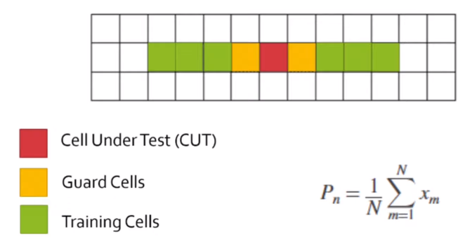
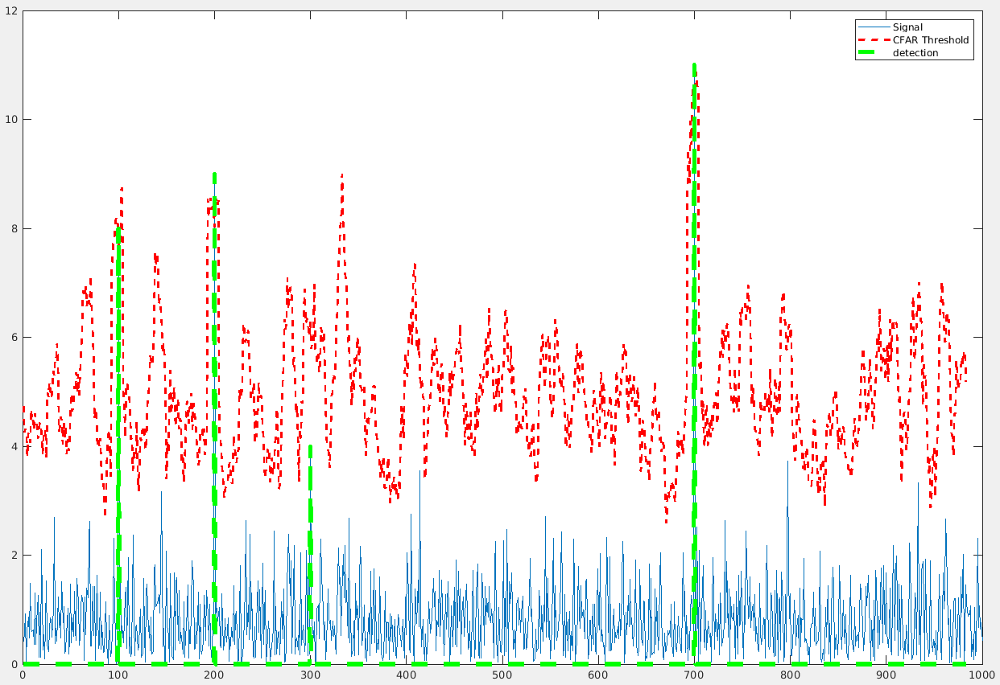
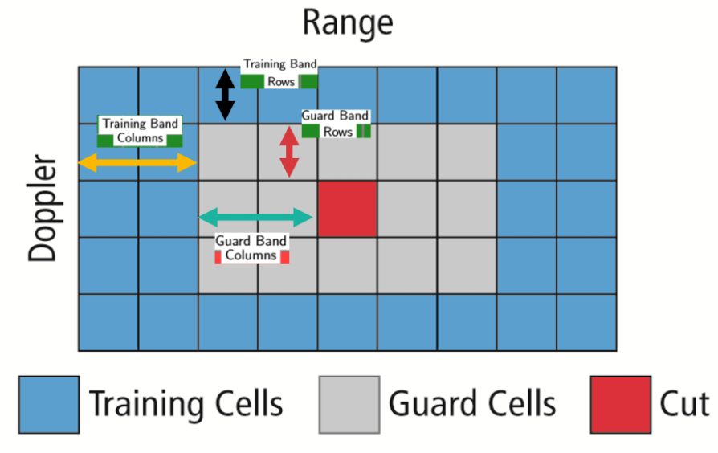
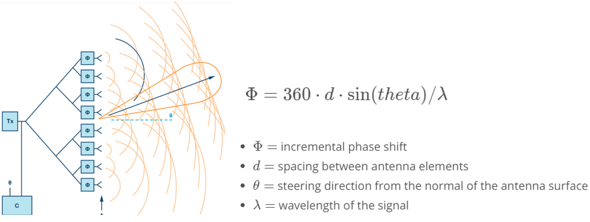

# Lecture 3-3 Clutter, CFAR, AoA

### I. Clutter

Radar signal would be also reflected from environment and unwanted objects (ground, buildings, trees, rain, etc.) besides from the targets. Those false signals are called **Clutter**.

Methods to remove the clutter:
- Remove signal having *zero* doppler velocity
    * because unwanted objects are usually stationary
    * downside: fail to detect stationary targets
- Fixed clutter thresholding
    * reject signal below a certain threshold value
    * downside
        + if set too high, it masks signals from valid targets
        + if set too low, too many false alarms will be generated
- Dynamic thresholding
    * vary the threshold level to reduce the false alarm rate
    * Example: Constant False Alarm Rate (CFAR)

### II. CFAR

Constant False Alarm Rate (CFAR) technique estimates the level of interference in radar range and doppler cells (*Training Cells*) on either or both sides of the *Cell Under Test* (CUT). Assume that the noise/interference is spatially or temporarily homogeneous, it will produce a constant false alarm rate, which is independent from noise or clutter level.

Multiple categories of CFAR:
- Cell Averaging CFAR (CA-CFAR)
- Ordered Statistics CFAR (OS-CFAR)
- Maximum Minimum Statistic (MAMIS CFAR)
- and others...

### III. CA-CFAR

As discussed in the [Lecture 3-2](./lec3-2-range-doppler-estimation.md), the FFT bins are generated on implementing range and doppler FFTs across a number of chirps. CFAR process includes the sliding of a window across the cells in FFT bins.

- Cell Under Test (CUT)
    * cell that is tested to detect the presence of the target by comparing the signal level against the noise threshold
- Training Cells
    * noise is estimated by averaging the noise under the training cells
- Guard Cells
    * cells next to CUT, preventing the target signal from leaking into the training cells
- Threshold Factor (Offset)
    * use an offset value to scale the noise threshold

#### Exercise: 1D CFAR

Using the MATLAB code [c01621d](https://github.com/fanweng/Udacity-Sensor-Fusion-Nanodegree/commit/c01621d97646961b15de47536271ed53ed3eae15), I buried four target signals at Bin 100, 200, 300 and 700 with random noise. Then CA-CFAR was applied to extract four signals with proper configurations of number of training cells, guard cells and offset.

### IV. 2D CFAR

1. Determine the number of Training cells for each dimension Tr and Td. Similarly, pick the number of guard cells Gr and Gd.
2. Slide the Cell Under Test (CUT) across the complete cell matrix
3. Select the grid that includes the training, guard and test cells. Grid Size = (2Tr+2Gr+1)(2Td+2Gd+1).
4. The total number of cells in the guard region and cell under test. (2Gr+1)(2Gd+1).
5. This gives the Training Cells : (2Tr+2Gr+1)(2Td+2Gd+1) - (2Gr+1)(2Gd+1)
6. Measure and average the noise across all the training cells. This gives the threshold
7. Add the offset (if in signal strength in dB) to the threshold to keep the false alarm to the minimum.
8. Determine the signal level at the Cell Under Test.
9. If the CUT signal level is greater than the Threshold, assign a value of 1, else equate it to zero.
10. Since the cell under test are not located at the edges, due to the training cells occupying the edges, we suppress the edges to zero. Any cell value that is neither 1 nor a 0, assign it a zero.

### V. Angle of Arrival (AoA)

*Phased array antenna* can steer the beam electronically in the desired direction. Such beam scanning technique requires each antenna element is excited with certain phase values. The phase shift increment is calculated by the following equation.

Angle of Arrive (AoA) thus is available because radar scans at different angles spatially.