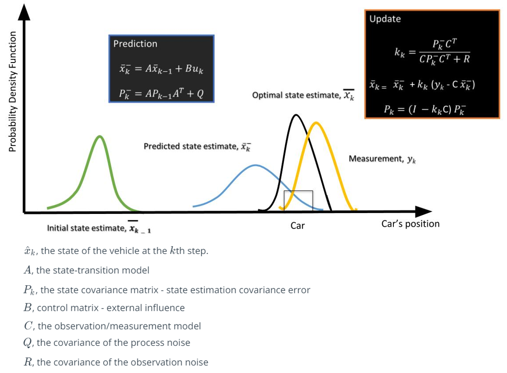
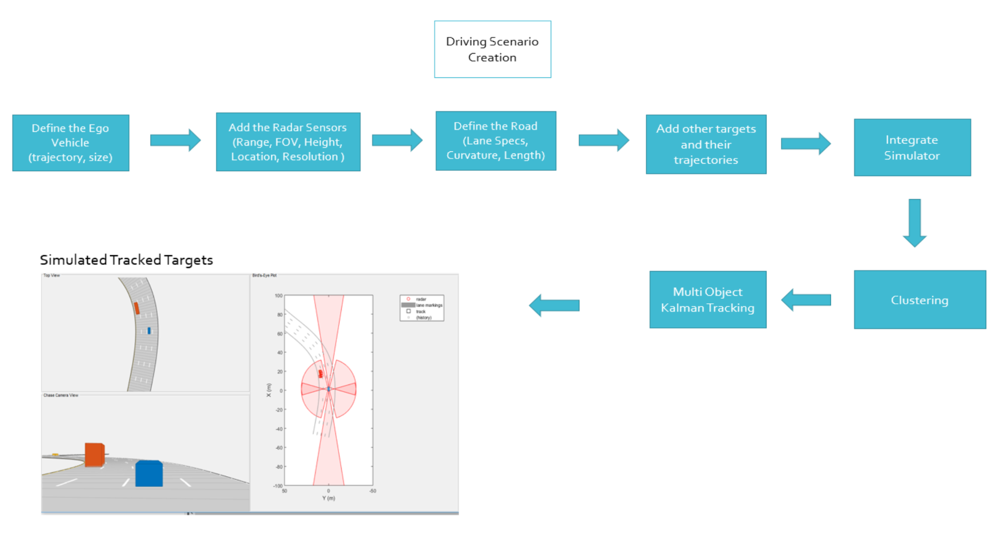
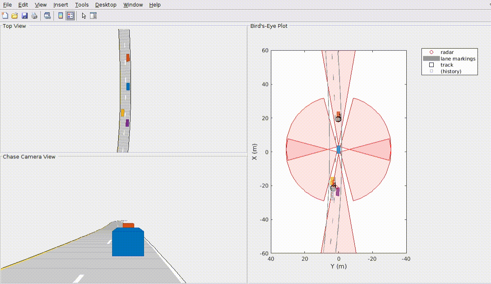

# Lecture 3-4 Clustering and Tracking

### I. Clustering

A radar can generate detections from plentitude of scattering points on the target.

- Clustering algorithm
    * groups the detection points based on their **proximity** measured by the **euclidean distance** between those points
    * all the detection points that are **within size of the target** are considered as one cluster, merged into a **centroid position**
    * each cluster is assigned a **new range and velocity**, which is the mean of measured range and velocity of the points within cluster

### II. Kalman Tracking

The purpose of Kalman filter is to estimate the **state** of a tracked vehicle, e.g. *position*, *velocity*, *acceleration*, or other properties. It uses measurements with noise and variation and other inaccuracies, produces values that tend to be closer to the true values. It's the vital algorithm to the majority of all modern radar tracking systems.

- Kalman filter procedure:
    * Prediction
        + use vehicle's motion model, e.g. `Xnew = Xprev + v * t`
        + predict the next state of vehicle using the current state (position) and velocity from the previous timestamp
    * Update
        + use noisy measurement data from sensors
        + combine the data with prediction data to produce a best-possible estimate of the state

`trackingKF` MATLAB object tutorial [HERE](https://www.mathworks.com/help/driving/ref/trackingkf.html).

Explanation of Kalman filter with MATLAB videos [HERE](https://www.youtube.com/watch?v=mwn8xhgNpFY&list=PLn8PRpmsu08pzi6EMiYnR-076Mh-q3tWr).

### III. MATLAB Sensor Fusion

In the [sensor_fusion_with_radar.m](../Radar/exercises/sensor_fusion_with_radar.m), Kalman filtering is implemented in the simulated environment using MATLAB. The code generates a scenario, simulate sensor detections, and use sensor fusion to track simulated vehicles.

- Generate the scenario (MATLAB Automated Driving Toolbox)
    * generate a road network
    * define vehicles on the road
    * move the vehicles
- Define radar
    * two long-range radar sensors on both the front and the back of the ego vehicle
    * two short-range radar sensors on each side of the ego vehicle
- Create a multi-object tracker
    * `multiObjectTracker` tracks the vehicles that are close to the ego vehicle
    * tracker uses a constant velocity linear Kalman filter that works with position and velocity
- Simulate the scenario
    * move the vehicles
    * call sensor simulation
    * perform the tracking
- Define the Kalman filter
    * `trackingKF` function is used to initiate the Kalman filter for any type of Motion Models
- Cluster detections
    * merge multiple detections suspected to be of the same vehicle to a single detection
    * closer than the size of a vehicle

The following video shows how the program runs:

