# Lidar and Radar Fusion with Kalman Filter

## I. Fusion Algorithm

- **First measurement**
    * receive initial measurement of the obstacle's position relative to the ego vehicle
- **Initialization of state and covariance metrics**
    * initialize the obstacle's position based on the first measurement
- Ego vehicle receives another measurement after a `dt`
- **Predict**
    * estimate the obstacle's position after the `dt` using constant velocity model
- **Update**
    * predicted location and measured location are combined to give an updated location. Kalman filter will put weight on them depending on the uncertainty of each value
- Loop over another measurement after `dt` and predict/update the location

## II. Update/Predict Processes

Measurement updates for Lidar and Radar are usually asynchronous. If they arrive simultaneously, use either one of the sensors to update/predict, and then update with the other sensor measurement.

`x`: mean state vector, containing object's position and velocity

`P`: state covariance matrix, which contains the uncertainty of the object's position and velocity

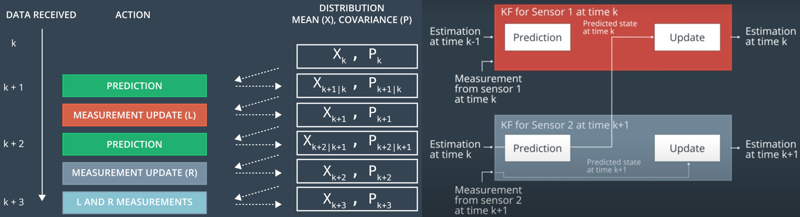

To implement the update and predict processes in C++, we need the [Eigen Library](http://eigen.tuxfamily.org/) which the version used in this course can be downloaded [HERE](https://d17h27t6h515a5.cloudfront.net/topher/2017/March/58b7604e_eigen/eigen.zip).

The source code: [kf_filter_equations.cpp](../Kalman_Filters/kf-equation-exercise/kf_filter_equations.cpp).

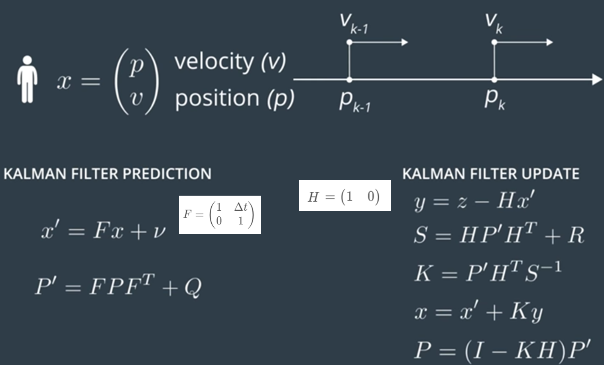

#### State prediction

The following diagram shows the detailed steps in the predict process.

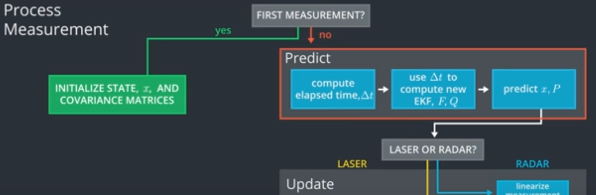

The **state prediction** uses the kinematic equation below. The *motion noise* and *process noise* refer to the uncertainty of position when predicting location. The *measurement noise* refers to the uncertainty in sensor measurement.

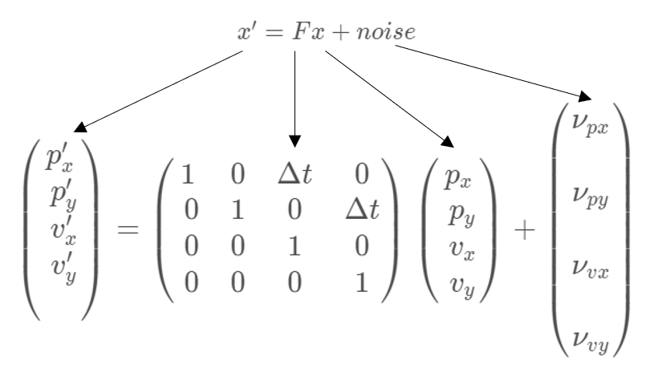

#### Process covariance matrix Q

The **state covariance matrix update equation** and **Q** is:

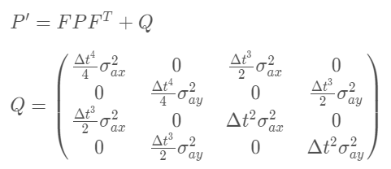

To deduce the Q value shown above, we need to model acceleration as a random noise.

## III. Laser Measurement

For Lidar update process, three metrics are important - measurement vector `z`, measurement matrix `H`, covariance matrix `R`.

The Lidar point cloud plus object detection yield the *object position* `(px, py)`, which is the **measurement vector** `z`. **Measurement matrix** `H` projects our *belief* about the object's current state into the measurement space of the sensor.

- `z = H * x`

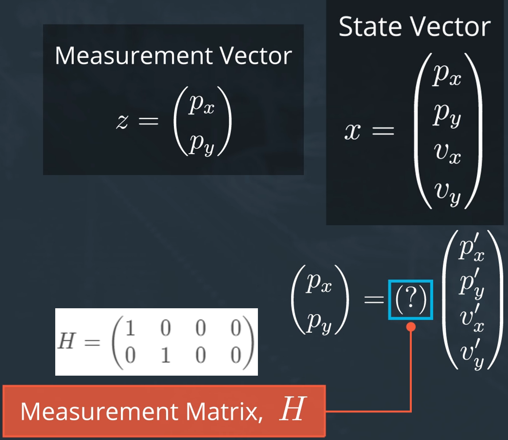

**Measurement noise covariance matrix** `R` represents the *uncertainty* in our sensor measurement. It's a 2x2 matrix with the off-diagonal 0s indicating that the noise processes are uncorrelated. Generally, the parameters for the random noise measurement matrix will be provided by the sensor manufacturer

The source code: [tracking.cpp](../Kalman_Filters/laser-measurement-exercise/tracking.cpp)

## IV. Radar Measurement

For radar, there is no `H` matrix that maps the state vector `x` into polar coordinate; instead, `h(x)` function helps to convert the cartesian coordinates to polar coordinates.

- Definition of radar variables in the polar coordinates
    * **range** (`rho`): radial distance from the vehicle to the object
    * **bearing** (`phi`): angle between `rho` and x-axis
    * **radial velocity** (`rho dot`): change of `rho` (angle rate)

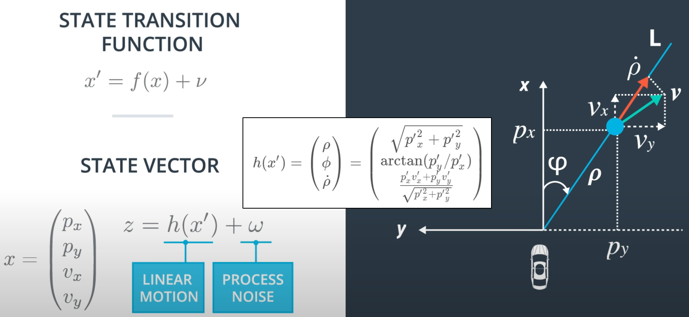

#### Linear approximation

`h(x)` is a nonlinear function, we cannot apply Gaussian distribution directly to it. Otherwise, the resulting distribution will not be a Gaussian. The solution is to use **first-order Taylor series expansion** of the `h(x)` as a linear approximation, which is also the idea of **extended Kalman filter (EKF)**.

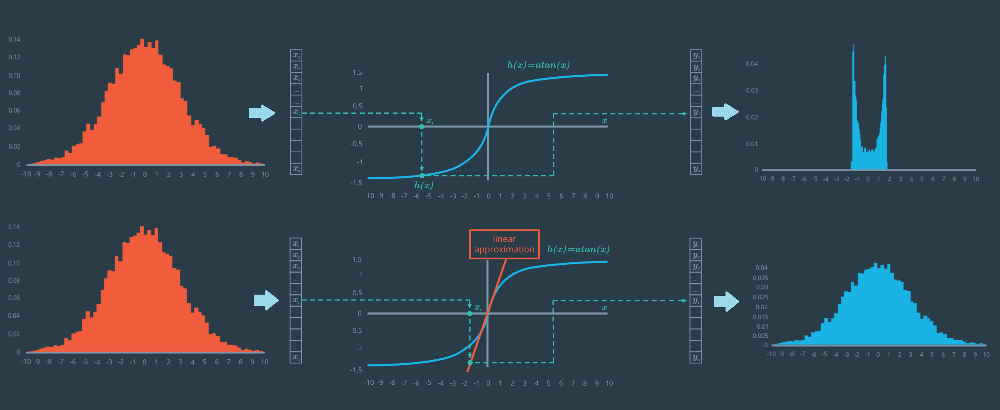

For example, the first-order Taylor series expansion of `h(x) = arctan(x)` function is:

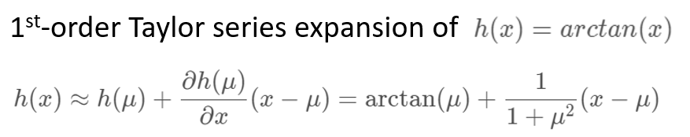

The general formula for the multi-dimensional Taylor series expansion looks like the below, where the `Df(a)` is called the **Jacobian matrix** and `D^2f(a)` is called the **Hessian matrix**. To derive a linear approximation of the `h(x)` function, we only keep the Jacobian matrix. Hessian matrix and other higher order terms are ignored.

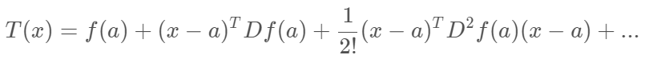

Jacobian matrix is shown below:

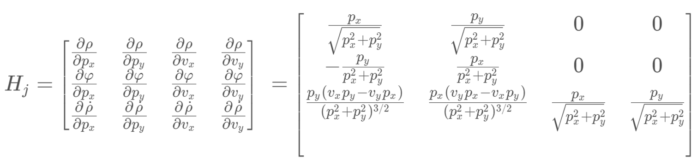

The source code: [cal_jacobian.cpp](../Kalman_Filters/jacobian-matrix-exercise/cal_jacobian.cpp)

#### EKF Algorithm

EKF equations are similar to the KF ones, but some main differences are:

- `P'` is calculated with `Fj`, not `F`
- `S`, `K` and `P` are calculated with `Hj`, not `H`
- `x'` is calculated with prediction update function `f`, not `F` matrix
- `y` is calculated with `h` function, not `H` matrix

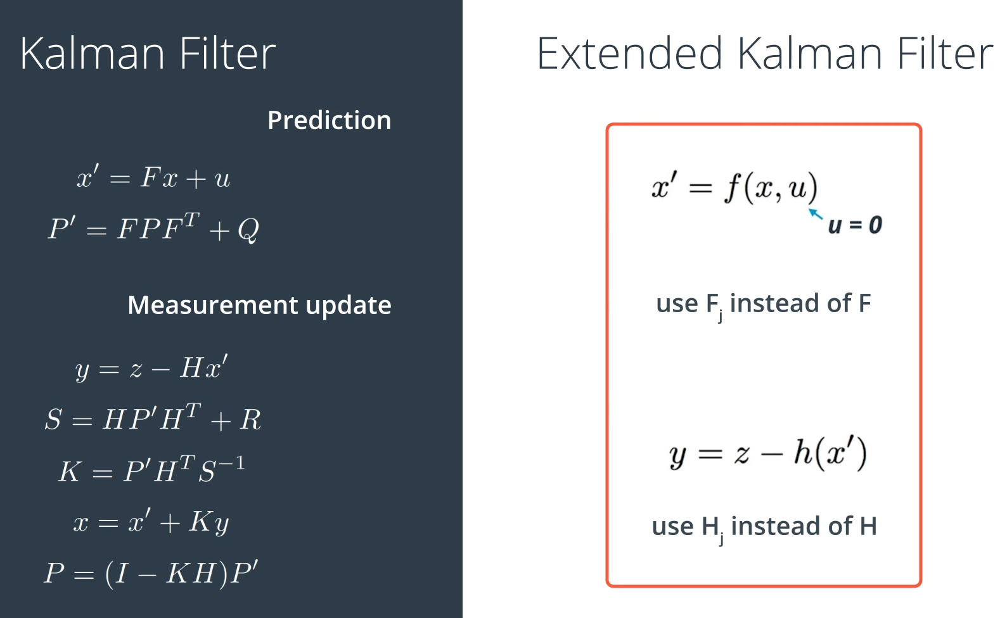

#### Root Mean Squared Error

To evaluate the accuracy of metrics, we can use **root mean squared error (RMSE)** to measure the deviation of the estimated state from the true state.

The source code: [cal_rmse.cpp](../Kalman_Filters/root-mean-squared-err-exercise/cal_rmse.cpp)

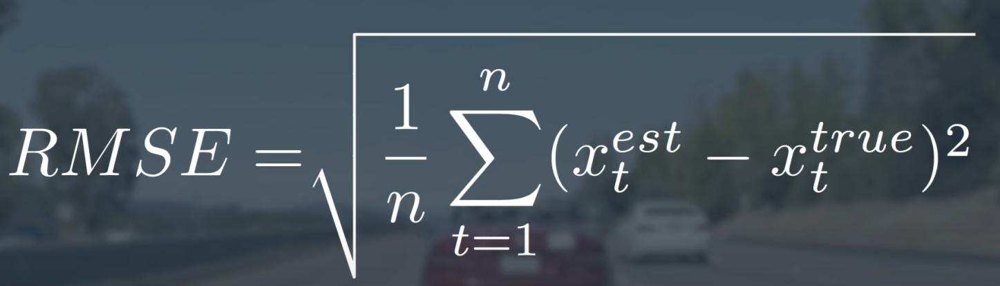

## V. Equation Cheatsheet

[Sensor Fusion EKF Reference.pdf](../Kalman_Filters/sensor-fusion-ekf-reference.pdf)