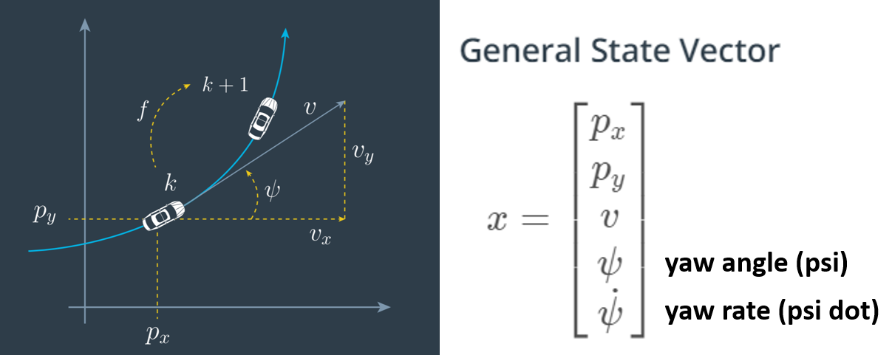
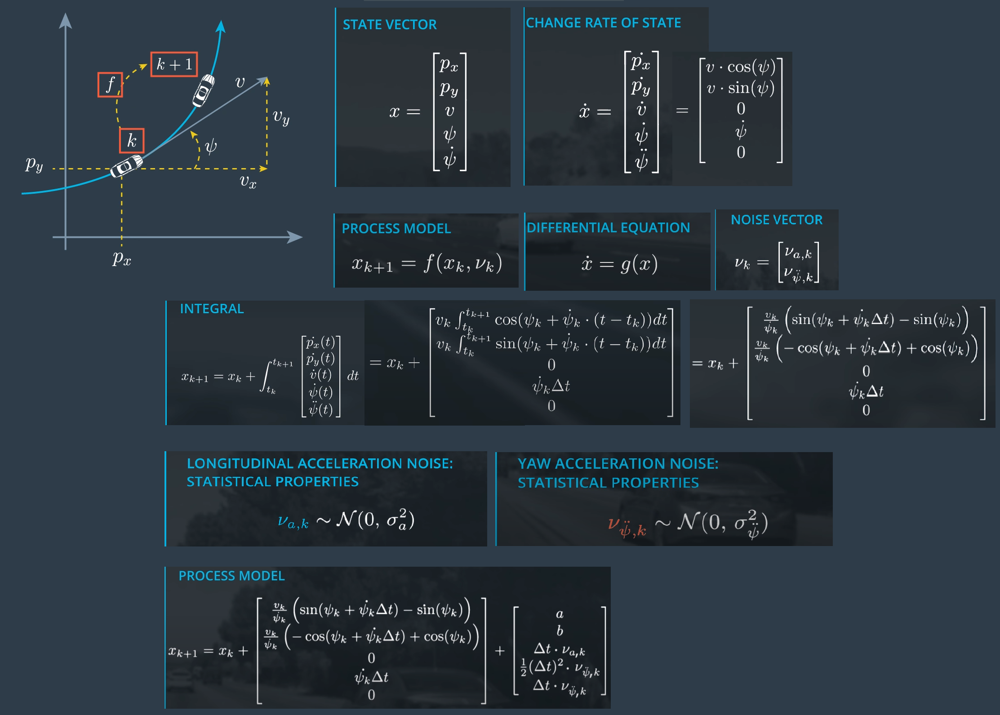
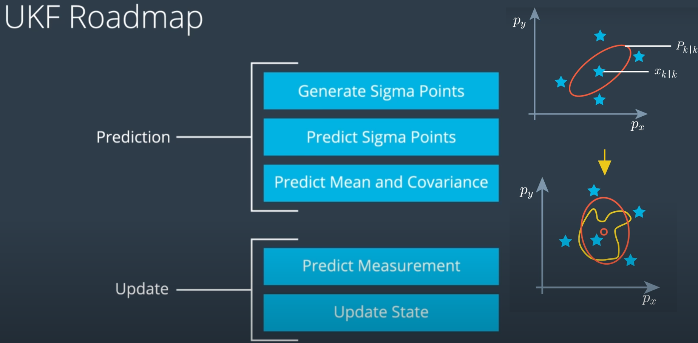
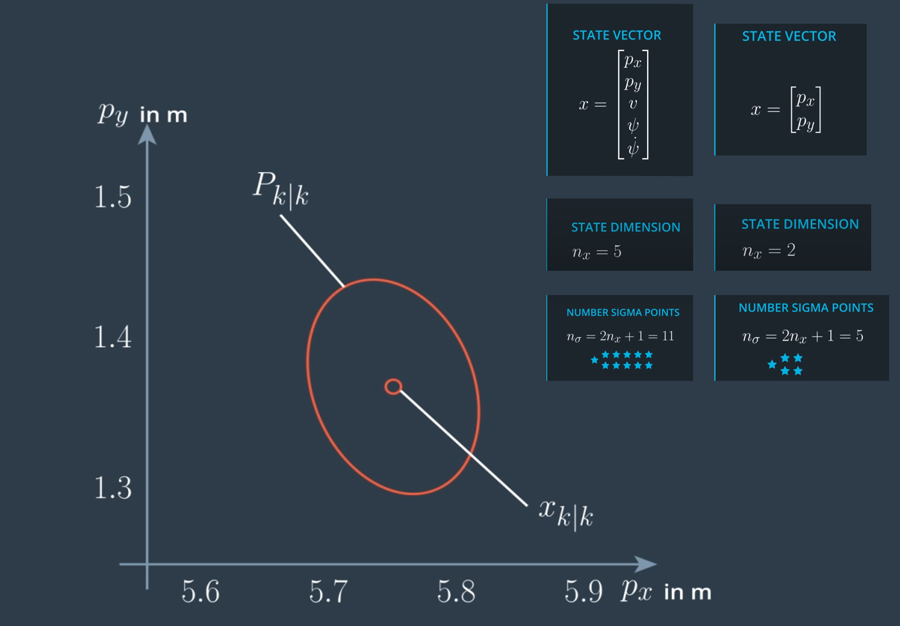
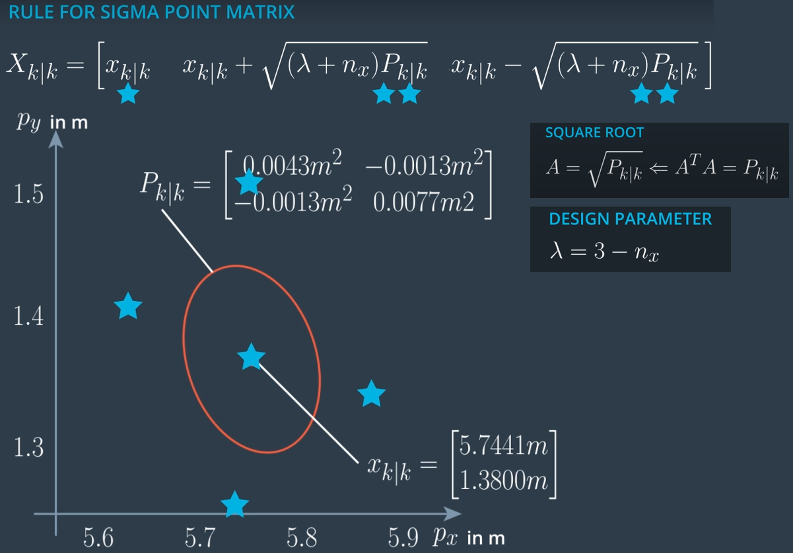
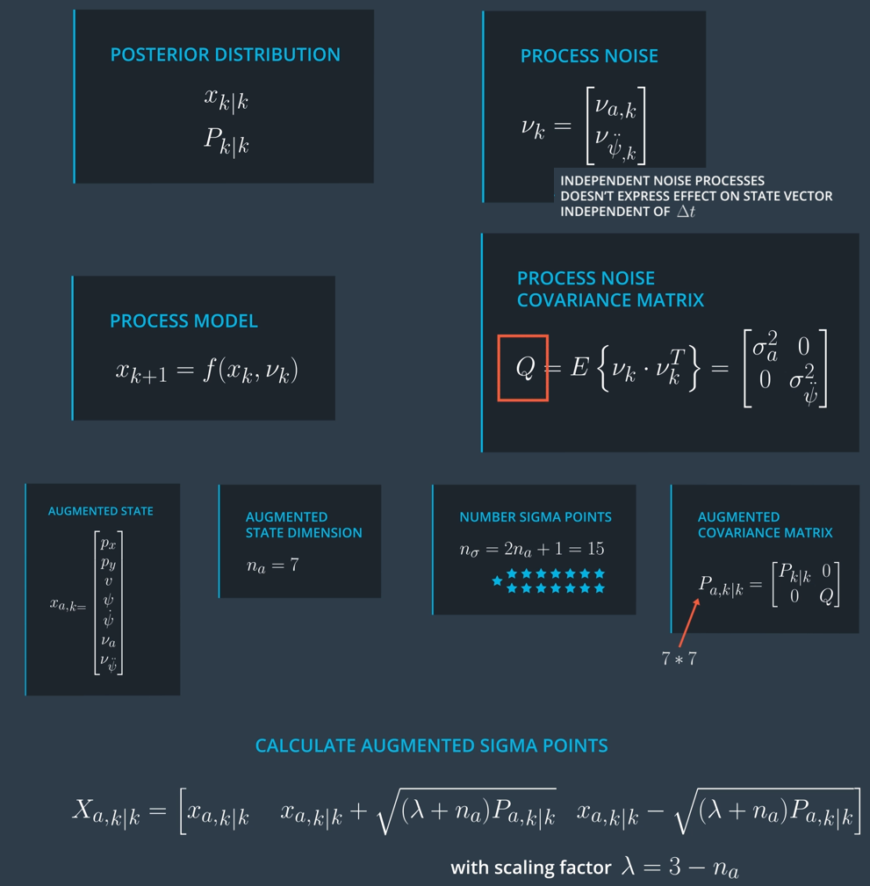
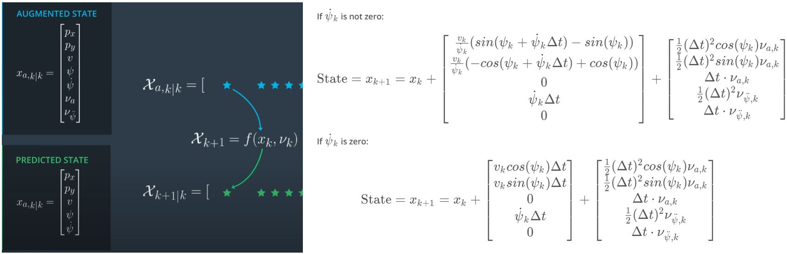
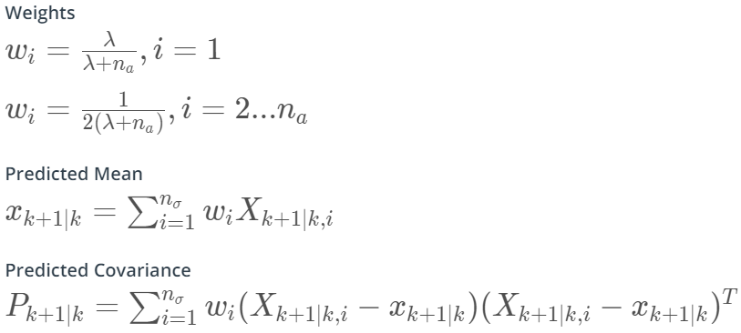
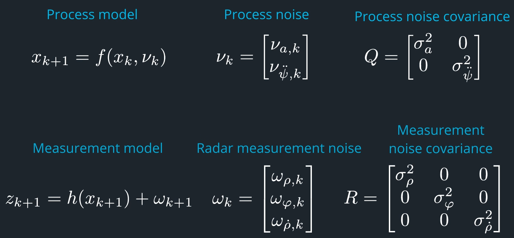
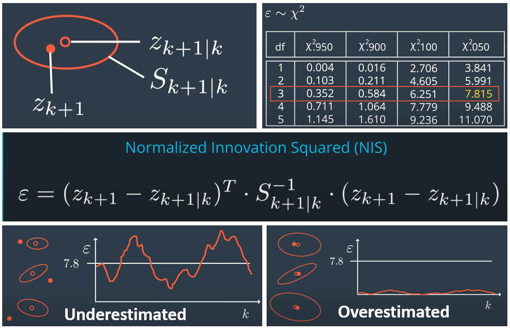

# Lecture 4-3: Unscented Kalman Filters

## I. CTRV Model

In the extended Kalman filter (EKF) lesson, the *constant velocity (CV)* model was used. But it has limitation when a vehicle drives straight at first and then goes into a turn.

There are many other motion models:
- constant turn rate and velocity (CTRV)
- constant turn rate and acceleration (CTRA)
- constant steering angle and velocity (CSAV)
- constant curvature and acceleration (CCA)

#### CTRV state vector

#### CTRV equations

## II. Unscented Kalman Filters (UKF)

The EKF would give a poor performance when the predict function `f(x)` and update function `h(x)` are highly nonlinear. The unscented Kalman filter (UKF) uses a deterministic sampling technique known as the *unscented transformation (UT)* to pick a minimal set of sample points (called **sigma points**) around the mean.

#### Generate sigma points

The number of sigma points depends on the dimension of state vector. For a simpler case, we can use a 2D state vector with `px` and `py` which gives 5 sigma points. 

The following equations calculate the 5 sigma points for a 2D state vector.

The source code: `UKF::GenerateSigmaPoints()` in the [ukf.cpp](../Kalman_Filters/ukf-exercise/ukf.cpp)

#### Generate sigma points for the UKF augmentation

Augmentation is needed if the process noise is nonlinear `f(xk, vk)`.

The source code: `UKF::AugmentedSigmaPoints()` in the [ukf.cpp](../Kalman_Filters/ukf-exercise/ukf.cpp)

#### Predict sigma points

The 7D augmented state needs to propagate using the process model to a 5D predicted state.

The source code: `UKF::SigmaPointPrediction()` in the [ukf.cpp](../Kalman_Filters/ukf-exercise/ukf.cpp)

#### Predict mean and covariance 

The following equations are useful to predict the mean and covariance.

The source code: `UKF::PredictMeanAndCovariance()` in the [ukf.cpp](../Kalman_Filters/ukf-exercise/ukf.cpp)

#### Predict radar measurement

In the prediction step, we generate augmented sigma points and predict the state using the sigma points. Now it's time to transform the predicted state into measurement space. The measurement model depends on the type of sensor is used. The process is similar to the prediction step - transforming a distribution through a nonlinear function `h(x)`. We can take the same steps but there are two shortcuts making it a bit easier - (1) reuse the sigma points generated, (2) skip the augmentation because the noise is simply addition.

The source code: `UKF::PredictRadarMeasurement()` in the [ukf.cpp](../Kalman_Filters/ukf-exercise/ukf.cpp)

#### Update state

The source code: `UKF::UpdateState()` in the [ukf.cpp](../Kalman_Filters/ukf-exercise/ukf.cpp)

## III. What to Expect from the Project

- Initializing the Kalman Filter
    * process noise parameters have an important effect on the KF
        + tune the *longitudinal and yaw acceleration noise parameters* in the project
    * initial values of *state vector* `x` and *state covariance matrix* `P` also affect the KF performance
        + once getting the first measurement from sensor, `px` and `py` of the state vector `x` can be initialized
        + for CTRV model, state covariance matrix `P` can be set as a 5x5 identity matrix with diagonal values set to 1 (top-left to bottom-right)
- Tuning the process noise parameters
    * linear/longitudinal acceleration noise parameter
    * angular/yaw acceleration noise parameter
- Using measurement noise parameters provided by sensor manufacturer

## IV. Evaluate the Prediction

If the **actual measurement** `z(k+1)` falls within the error eclipse formed by the **measurement prediction** `z(k+1|k)` and **covariance matrix** `S(k+1|k)`, it is a consistent case. However, we may underestimate or overestimate the results thus we call it inconsistent.

**Normalized Innovation Squared (NIS)** is used to evaluate the prediction.

## V. Equation Cheatsheet

[Sensor Fusion EKF Reference.pdf](../Kalman_Filters/sensor-fusion-ekf-reference.pdf)

[Quick Reference to the Eigen Library](https://eigen.tuxfamily.org/dox/group__QuickRefPage.html)